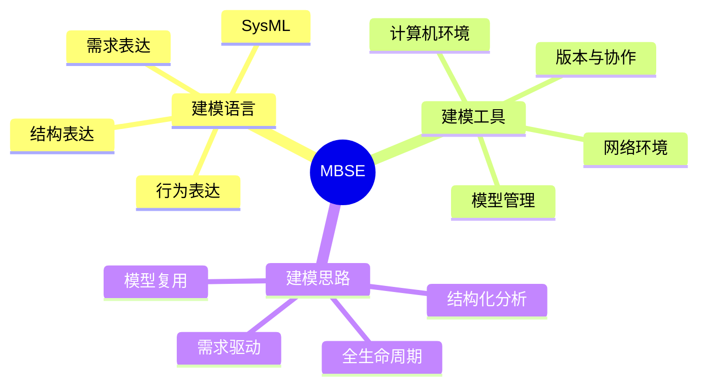

# 第五节 基于模型的系统工程（MBSE）

MBSE（Model-Based Systems Engineering）是建模方法在系统工程中的形式化应用。它让模型贯穿需求、分析、设计、验证和确认等活动，从概念设计开始一直支持到系统全生命周期。

## 1. MBSE 的三大支柱

| 支柱 | 作用 |
| --- | --- |
| 建模语言 | 规定模型元素、关系和语义，常见为 SysML |
| 建模工具 | 提供画图、分析、管理、协作和模型维护环境 |
| 建模思路 | 用模型支撑需求、分析、设计、验证和确认的全过程 |

## 2. 三类模型

| 模型类别 | 典型图 | 解决的问题 |
| --- | --- | --- |
| 需求模型 | 需求图、用例图、包图 | 系统必须满足什么要求、谁使用系统 |
| 行为模型 | 活动图、顺序图、状态机图 | 系统如何执行、交互和状态如何变化 |
| 结构模型 | 块定义图、内部块图、参数图 | 系统由什么组成、部件如何连接、参数如何约束 |

## 3. MBSE 与传统文档方式

| 维度 | 传统文档驱动 | MBSE |
| --- | --- | --- |
| 核心载体 | 分散的文字和图表 | 具有语义和关系的模型 |
| 需求追踪 | 依赖人工维护 | 通过模型关系追踪 |
| 变更影响 | 容易遗漏相关文档 | 可分析关联元素 |
| 团队协作 | 版本和理解容易不一致 | 共享模型和统一语义 |
| 验证方式 | 后期检查较多 | 在设计过程中持续验证 |

## 4. SysML 的考试定位

SysML 是面向系统工程的建模语言，适合描述硬件、软件、人员、流程和约束共同组成的系统。题目出现“需求、行为、结构模型”“模型贯穿全生命周期”时，应优先联想到 MBSE；题目出现“建模语言”时，通常对应 SysML。

## 5. 记忆口诀

> 语言定规则，工具来落地，思路贯穿生命周期；需求看要求，行为看过程，结构看组成。

## 下一节

[下一节：章节练习](./07-exercises)
