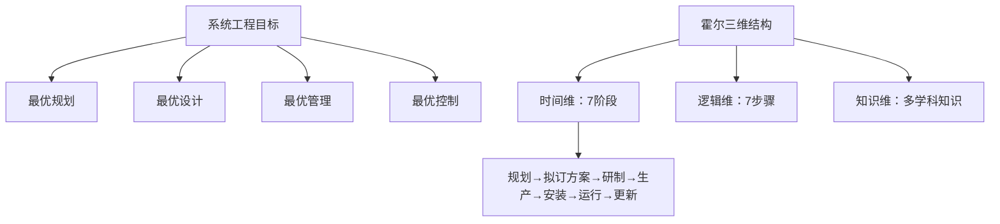

# 第六章历年真题复习

课件给出的真题集中考查系统工程中的霍尔三维结构。下面保留题干逻辑，并把每个空对应的知识点展开，便于复盘。

## 课件真题：霍尔三维结构

系统工程利用计算机作为工具，对系统的结构、元素、信息和反馈进行分析，以达到最优规划、最优设计、最优管理和最优控制的目的。霍尔三维结构是系统工程方法论的基础，由时间维、逻辑维和知识维组成。其中时间维表示系统的工作进程，一个具体工程项目可以分为 7 个阶段。

### 题目空格

| 空号 | 答案 | 解释 |
| --- | --- | --- |
| （18） | D：信息 | 系统工程分析的对象包括系统结构、元素、信息和反馈 |
| （19） | B：规划 | “最优规划、最优设计、最优管理、最优控制”是典型表述 |
| （20） | D：逻辑 | 三维结构为时间维、逻辑维、知识维 |
| （21） | C：研制 | 7 个阶段中，研制位于拟订方案之后、生产之前 |

## 真题推理链

## 延伸练习：不要只背顺序

1. 题目出现“先后阶段、工程进程、规划到更新”，选时间维。
2. 题目出现“明确问题、确定目标、优化、决策”，选逻辑维。
3. 题目出现“工程、医学、法律、管理等专业”，选知识维。
4. 题目出现“研制之后、生产之前”，答案是研制阶段。
5. 题目出现“复杂社会经济问题、比较现实与概念模型”，答案倾向切克兰德方法，而不是霍尔三维结构。

## 复习建议

- 先能写出三维结构，再分别写出时间维和逻辑维的 7 项内容。
- 把五类系统工程方法做关键词匹配，不必死记长段定义。
- 真题中的空格往往考固定搭配，看到“结构、元素、信息和反馈”要联想到系统工程目标表述。

## 下一节

[下一节：第六章总结](./09-summary)
