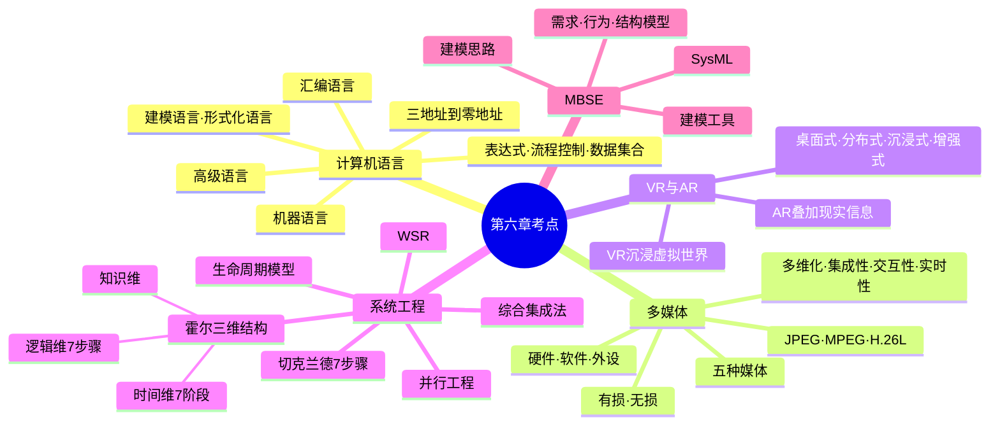

# 第六章总结

## 一页知识图

## 必背清单

### 计算机语言

- 三部分：表达式、流程控制、数据集合。
- 五类：机器语言、汇编语言、高级语言、建模语言、形式化语言。
- 指令地址码：三地址、二地址、一地址、零地址。

### 多媒体

- 五种媒体：感觉、表示、显示、存储、传输。
- 四项特征：多维化、集成性、交互性、实时性。
- 三类关键技术：音视频、通信、数据压缩。
- 常见格式：JPEG、MPEG、H.26L；压缩可按实时性、对象和有无损失分类。

### VR 与 AR

- VR：计算机生成虚拟环境，强调沉浸和自然交互。
- AR：保留真实环境，在真实时空中叠加虚拟信息。
- 四种分类：桌面式、分布式、沉浸式、增强式。

### 系统工程

- 霍尔三维结构：时间维、逻辑维、知识维。
- 时间维 7 阶段：规划、拟订方案、研制、生产、安装、运行、更新。
- 逻辑维 7 步骤：明确问题、确定目标、系统综合、系统分析、优化、决策、实施。
- 切克兰德：认识问题、根底定义、概念模型、比较探寻、选择、设计实施、评估反馈。
- 并行工程：全生命周期、并行集成、提高质量、降低成本、缩短周期。
- 综合集成法：开放复杂巨系统，定性定量综合。
- WSR：物理、事理、人理；七步从理解意图到实现构想。

### MBSE

- 三大支柱：建模语言、建模工具、建模思路。
- 三类模型：需求模型、行为模型、结构模型。
- SysML 是面向系统工程的建模语言。

## 考前快速辨析

| 看到的关键词 | 答案 |
| --- | --- |
| 七阶段、规划到更新 | 霍尔时间维 |
| 七步骤、明确问题到实施 | 霍尔逻辑维 |
| 多学科知识范围 | 霍尔知识维 |
| 根底定义、概念模型、比较 | 切克兰德 |
| 产品设计、制造、全生命周期并行 | 并行工程 |
| 开放复杂巨系统、定性定量 | 综合集成法 |
| 物理、事理、人理 | WSR |
| 模型贯穿需求、分析、设计、验证 | MBSE |

> 本章总体考查频率不高，但系统工程相关内容具有固定表述，适合通过关键词匹配和结构图快速得分。

## 复习顺序

1. 默写霍尔三维结构和两组“7 项”。
2. 对比切克兰德、并行工程、综合集成法、WSR。
3. 复述五类语言、五种媒体和 VR/AR 的区别。
4. 最后用练习题和真题检查是否能解释答案，而不是只记选项。

## 下一章

[下一章：系统配置与性能评价](../chapter-07/01-system-config-performance)
