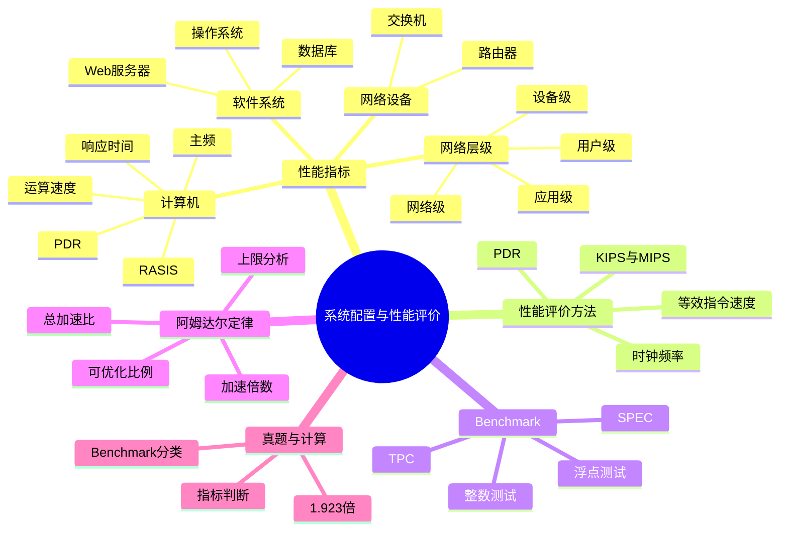

# 第七章 系统配置与性能评价

本章研究“系统配置是否合理、系统运行得有多快、如何公平地比较系统性能”。课件给出的考情是偶尔考查，通常涉及 1～2 分，但性能指标辨析和阿姆达尔定律计算都具有固定套路，适合系统掌握。

## 学习地图

## 章节目录

| 单元 | 内容 | 学习目标 |
| --- | --- | --- |
| 01 | [性能指标](./02-performance-index) | 按对象掌握计算机、网络设备和软件系统指标 |
| 02 | [性能评价方法](./03-performance-evaluation) | 区分主频、KIPS/MIPS、等效指令速度和 PDR |
| 03 | [Benchmark 基准测试](./04-benchmark) | 掌握整数、浮点、SPEC、TPC 及测试程序层次 |
| 04 | [阿姆达尔定律](./05-amdahl-law) | 会套公式、拆分时间并解释加速上限 |
| 05 | [章节练习](./06-exercises) | 训练指标判断与性能计算 |
| 06 | [历年真题复习](./07-past-exams) | 回顾课件中的性能指标和 Benchmark 真题 |
| 07 | [第七章总结](./08-summary) | 用一页表格完成考前复盘 |

## 推荐学习顺序

1. 先按“评价对象”整理指标，不要把路由器指标和操作系统指标混在一起。
2. 再区分测量方法：主频是硬件时钟，MIPS 是指令速度，PDR 是数据处理能力。
3. 通过 Benchmark 理解“用什么程序测什么性能”。
4. 最后掌握阿姆达尔定律，重点理解不可优化部分会限制总加速比。

## 高频辨析

| 题干关键词 | 优先判断 |
| --- | --- |
| 时钟周期、主频 | 计算机硬件性能指标 |
| 指令条数/每秒 | KIPS、MIPS |
| 程序中各类指令占比并折算 | 等效指令速度法 |
| 每秒处理的数据量 | PDR |
| 整数/浮点处理器能力 | MIPS/MFLOPS 测试 |
| 事务处理/决策支持 | TPC-C/TPC-D/TPC-E |
| 优化一部分后问整体加速比 | 阿姆达尔定律 |

[上一章：其他计算机系统基础知识](../chapter-06/09-summary)

## 下一节

[下一节：性能指标](./02-performance-index)
