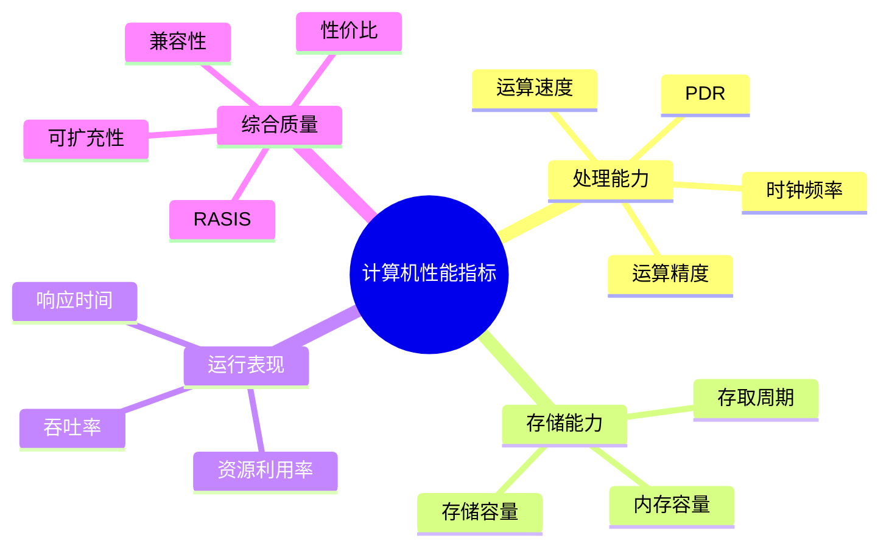
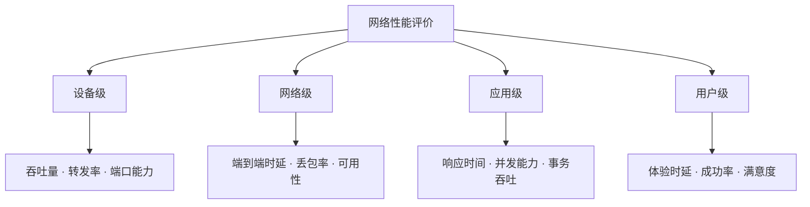

# 第一节 性能指标

性能指标必须结合“评价对象”理解。同一个词在不同层级含义可能不同，例如吞吐量既可以描述设备，也可以描述网络、操作系统或 Web 服务。

## 1. 计算机性能指标

| 指标 | 含义 | 题目中的常见说法 |
| --- | --- | --- |
| 时钟频率/主频 | CPU 时钟周期的倒数，反映基本节拍 | 主频越高，通常执行节拍越快 |
| 运算速度 | 完成运算或执行指令的速度 | 每秒处理多少指令 |
| 运算精度 | 数据表示和计算结果的精细程度 | 整数、浮点、字长 |
| 内存/存储容量 | 可保存数据和程序的空间大小 | RAM、磁盘容量 |
| 存取周期 | 完成一次存取操作所需的时间 | 周期越短，访问越快 |
| PDR | 单位时间处理的数据量 | Processing Data Rate |
| 吞吐率 | 单位时间完成的任务量 | 系统持续处理能力 |
| 响应时间 | 从请求到获得结果的时间 | 用户感知速度 |
| 资源利用率 | 资源被有效使用的比例 | CPU、内存、I/O 利用率 |

### RASIS

RASIS 用于描述系统运行质量：

| 字母 | 英文 | 含义 |
| --- | --- | --- |
| R | Reliability | 可靠性，系统在规定条件下持续正确运行 |
| A | Availability | 可用性，需要时系统能正常提供服务 |
| S | Serviceability/Maintainability | 可维护性，故障定位、修复和恢复的难易程度 |
| I | Integrity | 完整性，数据和系统不被未授权破坏或篡改 |
| S | Security | 安全性，抵御未授权访问和攻击 |

课件还列出平均故障响应时间、兼容性、可扩充性和性能价格比等扩展指标。

## 2. 路由器性能指标

路由器同时涉及转发能力、协议能力、接口能力和管理能力：

| 类别 | 典型指标 |
| --- | --- |
| 吞吐与转发 | 设备吞吐量、端口吞吐量、全双工线速转发能力、背靠背帧数、路由表大小 |
| 丢包与时延 | 丢包率、时延、时延抖动 |
| QoS/VPN | QoS、VPN 支持能力、带宽分配、队列管理、端口硬件队列数 |
| 协议 | RIP、RIP2、BGP、CIDR、IGMP、DVMRP、MOSPF、PIM、RSVP 等 |
| 接口与管理 | 端口密度、带外管理、基于 Web 的管理、网管类型、端口镜像 |
| 业务支持 | IPv6、语音、语音压缩、负载均衡、链路聚合 |

## 3. 交换机性能指标

交换机的指标尤其关注二层/三层交换能力、缓存、端口和 VLAN/QoS：

- 交换机类型、配置和支持的网络类型。
- 最大 ATM 端口数、最大 SONET 端口数、最大局域网端口数。
- 背板带宽、最大 MAC 地址表大小、最大电源数和缓存大小。
- 路由协议、VLAN 数量、网管类型、支持端口镜像和端口链路聚合。
- QoS 能力、每端口最大优先级队列数、基于策略的二层/三层交换。
- 冗余电源、热插拔组件、管理卡、交换结构、接口模块和冷却系统。

## 4. 网络层级性能指标

课件把网络性能分成设备级、网络级、应用级和用户级；题目问“网络整体”时，不要只回答某一台设备的端口吞吐量。

## 5. 操作系统性能指标

- 系统可靠性。
- 系统吞吐率（单位时间完成的任务量）。
- 系统响应时间。
- 系统资源利用率。
- 可移植性。

## 6. 数据库管理系统性能指标

数据库指标可分为数据库本身和数据库管理系统两部分：

| 维度 | 指标 |
| --- | --- |
| 数据规模 | 数据库大小、表数量、单表大小、表中允许的记录数/行数 |
| 索引能力 | 单个记录大小、表上索引数、数据库允许的索引数量 |
| 并发能力 | 最大并发事务处理能力、最大连接数、负载均衡能力 |
| 运行表现 | 查询语句性能、吞吐率、响应时间 |

## 7. Web 服务器性能指标

Web 服务器最常见的三个指标是：最大并发连接数、响应延迟和吞吐量。题目问“不是 Web 服务器主要指标”时，通常可以排除丢包率、端口吞吐量、转发协议等网络设备指标。

## 下一节

[下一节：性能评价方法](./03-performance-evaluation)
