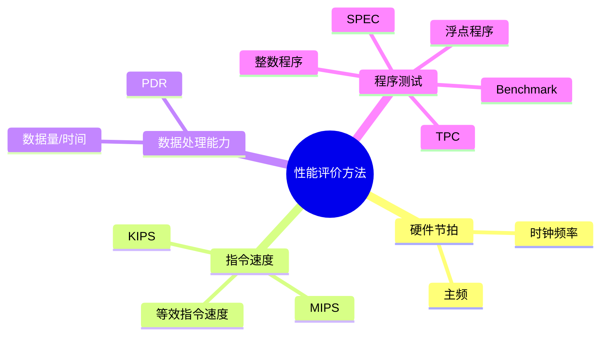

# 第二节 性能评价方法

性能评价方法回答的是“如何测量性能”，不要和上一节的“测量什么指标”混淆。

## 1. 常用方法



### 1.1 时钟频率

时钟频率是时钟周期的倒数。一般情况下，主频越高，处理器的基本节拍越快，但实际性能还受指令集、流水线、缓存、内存和程序负载影响，因此不能只用主频比较整机性能。

### 1.2 指令执行速度

KIPS 和 MIPS 分别表示每秒执行千条、百万条指令：

```text
KIPS = 每秒执行的指令数 / 10^3
MIPS = 每秒执行的指令数 / 10^6
```

MIPS 适合描述指令执行速度，但不同处理器的指令复杂度不同，单纯比较 MIPS 可能不公平。

### 1.3 等效指令速度法

等效指令速度法统计程序中不同类型指令的比例，再按给定权重或执行时间进行折算，得到一个统一的等效速度。它适用于不同指令类型执行代价不同的情况。

```text
等效执行时间 = Σ（某类指令比例 × 该类指令的平均执行时间）
等效速度 = 指令总数 / 等效执行时间
```

题目如果强调“统计各类指令在程序中的占比并进行折算”，就是等效指令速度法。

### 1.4 PDR

PDR（Processing Data Rate，数据处理速率）用单位时间处理的数据量衡量机器性能。PDR 越大，表示机器的数据处理能力越强。它与每条指令包含的平均操作数、每条指令的平均运算速度有关。

## 2. Benchmark 基准程序法

Benchmark 是把应用程序中最频繁、最具代表性的核心程序抽取出来，作为评价计算机性能的标准程序。它是用户普遍认可的测试性能方法之一。

使用 Benchmark 时要注意：

- 测试结果依赖程序负载，不能脱离应用场景理解。
- 不同 Benchmark 关注的对象不同，整数、浮点、事务处理不可混为一谈。
- 标准程序可以提高不同系统之间比较的可重复性。

## 3. 四种程序层次

| 类型 | 特点 | 适用目的 |
| --- | --- | --- |
| 真实程序 | 直接使用实际应用 | 最接近真实体验，但难以控制变量 |
| 核心程序 | 从真实应用中抽取最频繁部分 | 突出关键负载 |
| 小型基准程序 | 规模较小、针对某类操作 | 快速比较某项能力 |
| 合成基准程序 | 人工合成代表性负载 | 可控、可重复、便于标准化 |

## 方法对比

| 方法 | 测量重点 | 局限 |
| --- | --- | --- |
| 主频 | 时钟节拍 | 不能代表整机实际性能 |
| MIPS | 指令执行速度 | 不同指令复杂度导致可比性有限 |
| 等效指令速度 | 按指令构成折算 | 需要掌握指令比例和权重 |
| PDR | 单位时间数据处理量 | 需明确数据量口径 |
| Benchmark | 特定负载下综合表现 | 结果依赖测试程序和场景 |

## 下一节

[下一节：Benchmark 基准测试](./04-benchmark)
