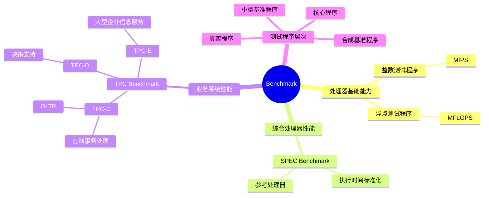

# 第三节 Benchmark 基准测试

Benchmark 不是一个具体软件名称，而是一类用于比较系统性能的标准程序或测试集合。选择 Benchmark 时，应先看题目要测整数、浮点、处理器综合性能，还是事务和决策支持能力。

## 1. 分类地图



## 2. 整数与浮点测试

| 测试类型 | 指标 | 关注能力 |
| --- | --- | --- |
| 整数测试程序 | MIPS | 整数指令处理能力、通用计算性能 |
| 浮点测试程序 | MFLOPS | 浮点运算能力，理论峰值浮点速度 |

MFLOPS 表示每秒百万次浮点运算。题目出现“理论峰值浮点速度”时，通常指 MFLOPS。

## 3. SPEC Benchmark

SPEC（Standard Performance Evaluation Corporation）基准程序集重点面向处理器性能。常见的比较方式是把被测计算机执行测试程序的时间，与参考处理器执行相同程序的时间进行标准化，形成可比较的结果。

```text
相对性能 = 参考处理器执行时间 / 被测处理器执行时间
```

执行时间越短，通常说明处理能力越强；不要把 SPEC 和专门测试数据库事务的 TPC 混淆。

## 4. TPC Benchmark

TPC（Transaction Processing Performance Council）用于评价事务处理、数据库处理、企业管理和决策支持等系统级性能。

| 基准 | 重点业务 |
| --- | --- |
| TPC-C | 联机事务处理（OLTP） |
| TPC-D | 决策支持 |
| TPC-E | 大型企业信息服务 |

题目出现“事务处理”优先选 TPC-C；出现“决策支持”优先选 TPC-D；出现“大型企业信息服务”优先选 TPC-E。

## 5. 选择 Benchmark 的步骤

1. 明确被测对象：处理器、数据库、网络还是整机。
2. 明确负载类型：整数、浮点、事务、决策支持或综合应用。
3. 选择与实际场景相近的测试程序集。
4. 统一硬件、软件、编译器和测试参数。
5. 使用标准化结果比较，而不是只看宣传峰值。

## 高频陷阱

- Benchmark 是基准程序方法，不是“某一项硬件指标”。
- MIPS 面向整数/指令速度，MFLOPS 面向浮点运算。
- SPEC 主要关注处理器性能；TPC 主要关注事务和业务系统性能。
- TPC-C 的关键词是 OLTP，不是决策支持。

## 下一节

[下一节：阿姆达尔定律](./05-amdahl-law)
