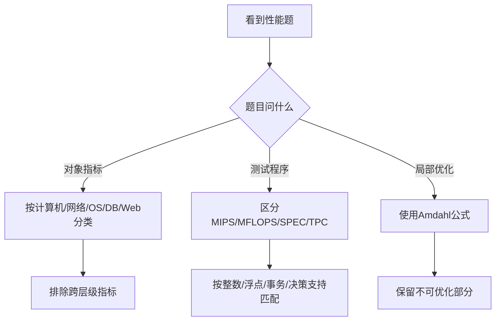

# 第七章历年真题复习

课件真题集中在性能指标、Benchmark 分类和阿姆达尔定律。下面按题型归纳，并补上判断逻辑。

## 1. 性能指标判断题

| 题目关键词 | 答案方向 | 理由 |
| --- | --- | --- |
| 计算机主要指标：时钟频率、（）、运算精度、内存容量 | 运算速度/处理速度 | 与主频、精度、容量并列，属于计算机本体性能 |
| 数据库允许的索引数量、最大并发事务处理能力 | 数据库规模与并发能力 | 前者描述结构能力，后者描述并行处理能力 |
| Web 服务器主要指标 | 最大并发连接数、响应延迟、吞吐量 | 丢包率、端口吞吐量更偏网络设备 |
| 操作系统主要指标 | 可靠性、吞吐率、响应时间、资源利用率、可移植性 | 反映系统运行与资源管理表现 |

## 2. Benchmark 真题

### 题型一

把应用程序中应用最频繁的部分核心程序作为评价计算机性能的标准程序，称为（ ）程序。

答案：核心程序。它从实际应用中抽取最能代表负载的部分，用于构造基准测试。

### 题型二

下列不是 Web 服务器主要性能指标的是（ ）。

答案方向：优先排除丢包率、路由协议、端口转发能力等网络设备指标；Web 服务器主要看最大并发连接数、响应延迟和吞吐量。

### 题型三

TPC-C 是（ ）的基准程序。

答案：在线事务处理（OLTP）。TPC-D 对应决策支持，TPC-E 对应大型企业信息服务。

## 3. 阿姆达尔定律真题

某功能的处理时间占整个系统运行时间的 60%，若把该功能处理速度提高到原来的 5 倍，根据阿姆达尔定律，系统处理速度提高：

```text
原总时间 = 1
不可优化部分 = 1 - 0.6 = 0.4
优化后部分 = 0.6 / 5 = 0.12
新总时间 = 0.4 + 0.12 = 0.52
Speedup = 1 / 0.52 ≈ 1.923
```

答案：**1.923 倍**。

## 4. 真题解题路线



## 复习提醒

- “标准程序”是 Benchmark，“最频繁部分”通常指核心程序。
- “浮点”对应 MFLOPS，“整数/指令速度”对应 MIPS。
- “在线事务处理”对应 TPC-C，不要和 TPC-D 的决策支持混淆。
- 阿姆达尔题先把原总时间设为 1，最不容易出错。

## 下一节

[下一节：第七章总结](./08-summary)
