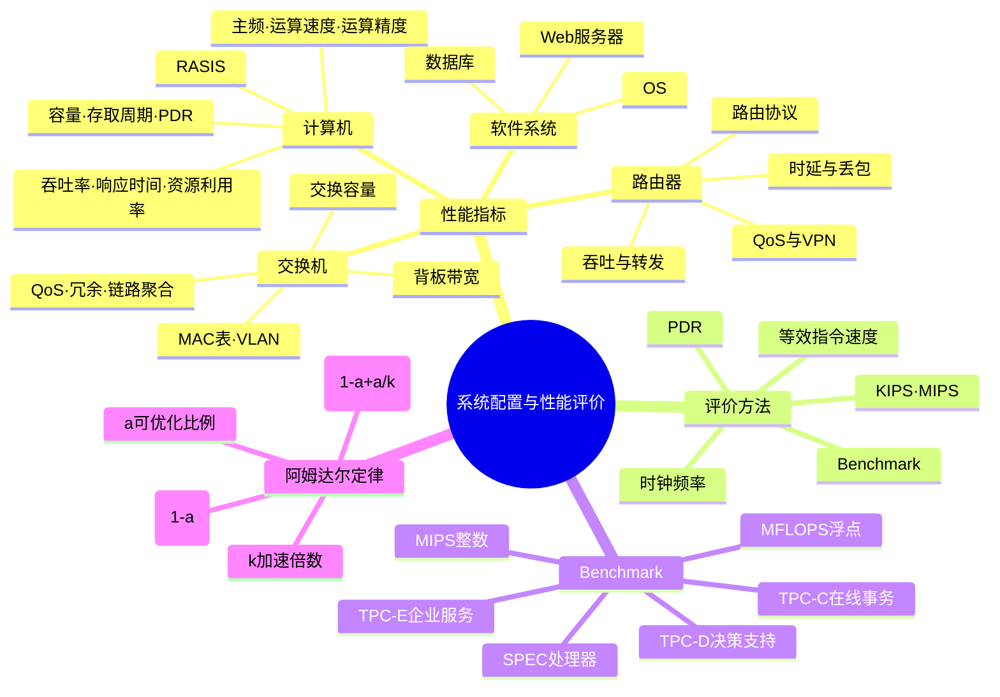

# 第七章总结

## 一页知识图



## 必背清单

### 性能指标

- 计算机：时钟频率、运算速度、运算精度、内存/存储容量、存取周期、PDR、吞吐率、响应时间、资源利用率、RASIS。
- RASIS：可靠性、可用性、可维护性、完整性、安全性。
- 路由器：设备/端口吞吐量、转发能力、路由表、时延、丢包、QoS、VPN、协议和端口能力。
- 交换机：交换容量、背板带宽、MAC 地址表、VLAN、QoS、缓存、冗余和端口能力。
- 操作系统：可靠性、吞吐率、响应时间、资源利用率、可移植性。
- 数据库：数据库大小、表和记录数量、索引数量、并发事务处理能力、连接数、负载均衡。
- Web 服务器：最大并发连接数、响应延迟、吞吐量。

### 评价方法

| 方法 | 关键词 |
| --- | --- |
| 时钟频率 | 时钟节拍、主频 |
| KIPS/MIPS | 每秒千条/百万条指令 |
| 等效指令速度 | 指令类型比例、折算 |
| PDR | 单位时间数据量 |
| Benchmark | 标准程序、可重复比较 |

### Benchmark

- 整数测试：MIPS。
- 浮点测试：MFLOPS。
- SPEC：处理器性能、标准化执行时间。
- TPC-C：在线事务处理（OLTP）。
- TPC-D：决策支持。
- TPC-E：大型企业信息服务。
- 测试程序层次：真实程序、核心程序、小型基准程序、合成基准程序。

### 阿姆达尔定律

```text
Speedup = 1 / ((1-a) + a/k)
```

- `a` 是可优化部分比例。
- `k` 是可优化部分的加速倍数。
- 不可优化部分是 `1-a`。
- 最大加速比是 `1/(1-a)`。
- 60% 部分提升 5 倍，整体提升约 1.923 倍。

## 考前快速辨析

| 看到关键词 | 答案 |
| --- | --- |
| 每秒百万条指令 | MIPS |
| 每秒百万次浮点运算 | MFLOPS |
| 应用中最频繁的核心程序 | 核心程序/Benchmark 来源 |
| 在线事务处理 | TPC-C |
| 决策支持 | TPC-D |
| 大型企业信息服务 | TPC-E |
| 局部优化后的整体性能 | 阿姆达尔定律 |
| Web 服务器并发用户能力 | 最大并发连接数 |

## 复习建议

本章通常以记忆题和一道性能计算题为主。先掌握对象—指标映射，再背 Benchmark 关键词，最后每天练习 2～3 道阿姆达尔定律变式题，重点检查是否保留了不可优化部分。

## 下一章

[下一章：信息系统基础知识](../chapter-08/01-information-system)
