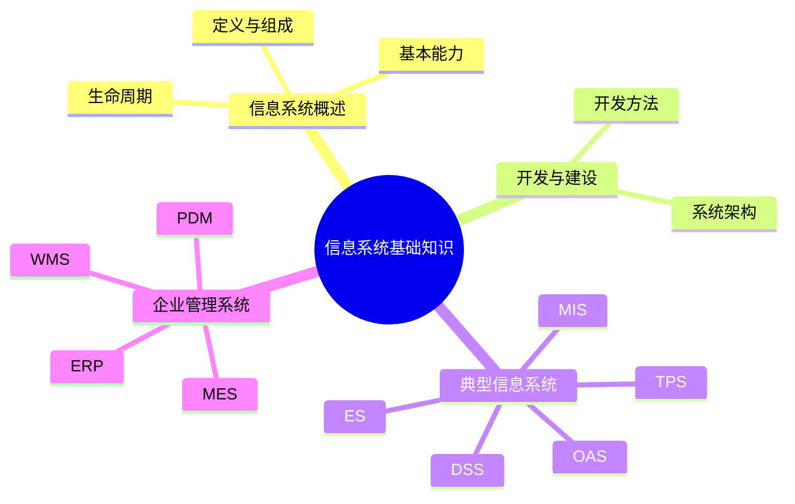

# 第一节 信息系统概述

> 本文依据用户提供的《8.信息系统基础知识》PDF 中“信息系统概述”部分整理与扩展，保持原有知识框架，并增加便于学习的目录、表格和总结。

---

## 1. 信息系统定义

信息系统是由 **计算机硬件、计算机软件、信息资源、信息用户和规章制度** 等组成，以处理信息为主要目标的人机系统。

其核心目标是：

- 信息采集
- 信息处理
- 信息存储
- 信息传输
- 信息共享
- 支撑管理与决策

---

## 2. 信息系统的六大基本能力

| 能力 | 说明 |
|------|------|
| 输入 | 获取外部信息 |
| 存储 | 保存数据 |
| 加工 | 数据处理、分析 |
| 输出 | 输出信息 |
| 控制 | 控制业务流程 |
| 反馈 | 根据结果持续优化 |

---

## 3. 信息系统的发展阶段

```text
电子数据处理(EDP)
        │
        ▼
管理信息系统(MIS)
        │
        ▼
决策支持系统(DSS)
        │
        ▼
战略信息系统(SIS)
        │
        ▼
现代企业信息系统
```

---

## 4. 企业常见信息系统

根据课程资料，本章重点介绍以下几类系统：

| 系统 | 全称 | 主要用途 |
|------|------|----------|
| TPS | 事务处理系统 | 日常业务处理 |
| MIS | 管理信息系统 | 管理分析 |
| DSS | 决策支持系统 | 辅助决策 |
| ES | 专家系统 | 模拟专家知识 |
| OAS | 办公自动化系统 | 办公协同 |
| ERP | 企业资源计划 | 企业资源管理 |
| WMS | 仓储管理系统 | 仓储物流 |
| MES | 制造执行系统 | 生产执行 |
| PDM | 产品数据管理 | 产品生命周期管理 |

---

## 5. 生命周期

课程资料给出的生命周期包括：

```text
立项
 ↓
规划
 ↓
分析
 ↓
设计
 ↓
实施
 ↓
运行维护
 ↓
升级或退役
```

---

## 6. 本节高频考点

⭐⭐⭐⭐⭐

- 信息系统组成
- 生命周期阶段
- 五大经典信息系统
- ERP、WMS、MES、PDM 的作用

---

## 7. 易混知识

| 概念 | 区别 |
|------|------|
| MIS | 面向管理层的信息管理 |
| DSS | 面向决策分析 |
| TPS | 面向事务处理 |

---

## 8. Mermaid 思维导图



---

## 9. 本节小结

本节主要建立信息系统整体框架，是后续学习开发方法、五大信息系统、ERP、CRM、SCM 与企业应用集成等内容的基础。建议优先掌握系统组成、生命周期以及各类信息系统的定位。

## 下一节

[下一节：信息系统开发方法](./03-development-methods)
