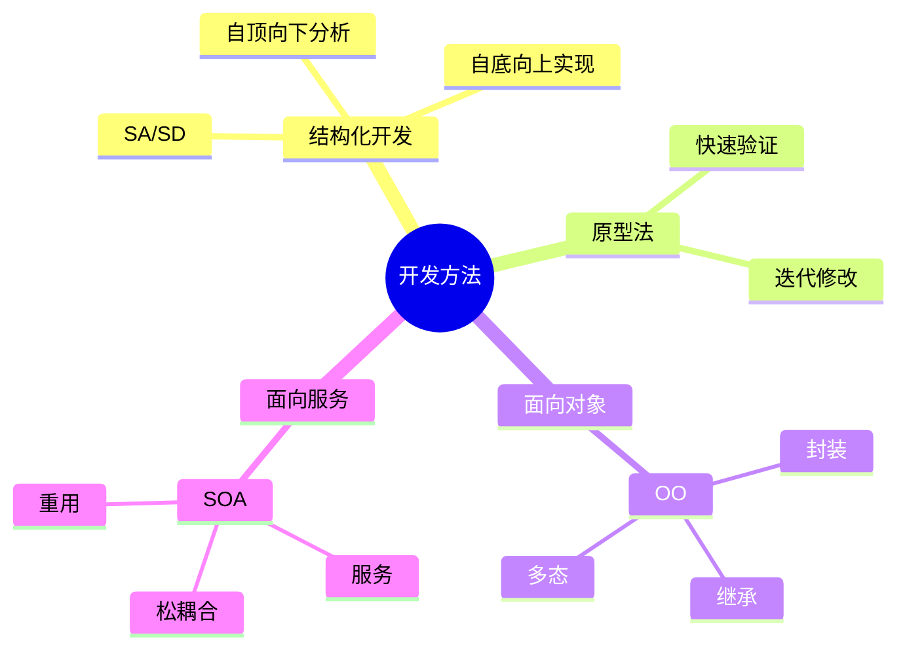

# 第二节 信息系统开发方法

> 本文依据《8.信息系统基础知识》PDF 中“信息系统开发方法”相关内容整理，并在不改变原有知识框架的基础上增加学习辅助内容。

---

## 目录

1. 开发方法概述
2. 结构化开发方法（SA/SD）
3. 原型法（Prototype）
4. 面向对象开发（OO）
5. 面向服务开发（SOA）
6. 四种开发方法对比
7. 高频考点
8. 易错点
9. Mermaid 思维导图
10. 本节小结

---

## 1. 开发方法概述

课程资料介绍了四种常见的信息系统开发方法：

| 方法 | 英文 | 特点 |
|---|---|---|
| 结构化开发 | SA/SD | 生命周期清晰，文档规范 |
| 原型法 | Prototype | 快速构建原型，反复修改 |
| 面向对象 | OO | 封装、继承、多态 |
| 面向服务 | SOA | 通过服务组合构建系统 |

---

## 2. 结构化开发方法（SA/SD）

## 核心思想

采用**自顶向下分析、自底向上实现**的方式，将复杂系统逐步分解。

## 基本流程

```text
需求分析
   ↓
概要设计
   ↓
详细设计
   ↓
编码
   ↓
测试
   ↓
运行维护
```

## 优点

- 文档规范
- 管理方便
- 适合大型项目

## 缺点

- 用户参与度较低
- 需求变化时修改成本高

---

## 3. 原型法（Prototype）

## 思想

先快速开发一个可运行原型，再根据用户反馈不断完善。

## 优点

- 用户参与度高
- 需求确认快
- 降低沟通成本

## 缺点

- 易造成架构设计不足
- 后期维护复杂

适用于需求不明确、交互要求高的项目。

---

## 4. 面向对象开发（OO）

课程资料强调 OO 是现代软件开发的重要方法。

## 三大特性

- 封装（Encapsulation）
- 继承（Inheritance）
- 多态（Polymorphism）

## 优势

- 可复用性高
- 易维护
- 易扩展

---

## 5. 面向服务开发（SOA）

SOA（Service-Oriented Architecture）通过服务实现系统集成。

## 特点

- 服务独立
- 松耦合
- 可重用
- 易集成

适用于大型企业系统和跨平台集成。

---

## 6. 四种开发方法对比

| 方法 | 优点 | 缺点 | 适用场景 |
|---|---|---|---|
| 结构化 | 规范、成熟 | 变更成本高 | 需求稳定 |
| 原型法 | 快速验证 | 架构可能不足 | 需求不明确 |
| OO | 易扩展、复用 | 学习成本较高 | 长期维护项目 |
| SOA | 集成能力强 | 设计复杂 | 企业级系统 |

---

## 7. 高频考点

★★★★★

- SA/SD 与 OO 的区别
- 原型法适用场景
- OO 三大特性
- SOA 的核心思想

---

## 8. 易错点

| 易混概念 | 说明 |
|---|---|
| 原型法 ≠ 最终产品 | 原型用于确认需求，可继续演化或废弃 |
| SOA ≠ 微服务 | 课程主要讲 SOA，不涉及微服务细节 |
| OO ≠ 面向过程 | OO 以对象建模，面向过程以过程为中心 |

---

## 9. Mermaid 思维导图



---

## 10. 本节小结

开发方法是信息系统建设的重要基础。本章重点掌握四种开发方法的特点、优缺点及适用场景，考试中常以对比选择题形式出现。

## 下一节

[下一节：五大信息系统](./04-tps-mis-dss-es-oas)
