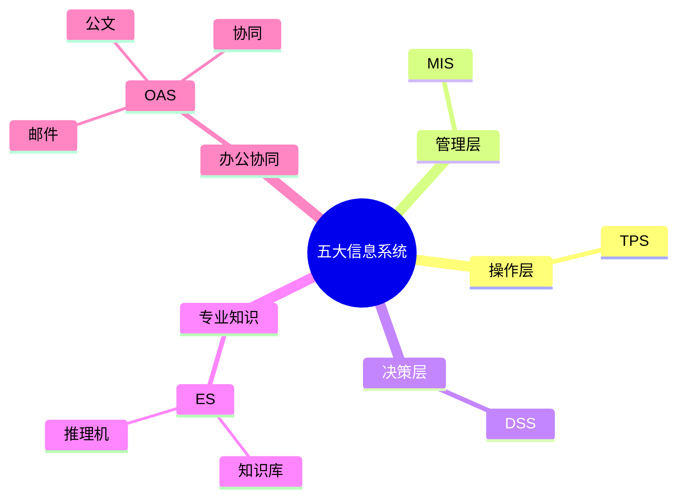

# 第三节 TPS、MIS、DSS、ES、OAS

> 本文依据《8.信息系统基础知识》PDF 中“五大信息系统”相关内容整理，并补充学习辅助内容，保持课程知识框架。

---

## 目录

1. 五大信息系统概述
2. TPS（事务处理系统）
3. MIS（管理信息系统）
4. DSS（决策支持系统）
5. ES（专家系统）
6. OAS（办公自动化系统）
7. 五大系统对比（★★★★★）
8. 高频考点
9. 易错点
10. Mermaid 思维导图
11. 本节小结

---

## 1. 五大信息系统概述

课程资料介绍了企业中常见的五类信息系统：

| 系统 | 英文 | 主要服务对象 | 核心作用 |
|---|---|---|---|
| TPS | Transaction Processing System | 操作层 | 日常业务处理 |
| MIS | Management Information System | 管理层 | 信息汇总与管理 |
| DSS | Decision Support System | 决策层 | 辅助分析与决策 |
| ES | Expert System | 专业人员 | 模拟专家知识推理 |
| OAS | Office Automation System | 全体办公人员 | 办公自动化与协同 |

---

## 2. TPS（事务处理系统）

## 定义

TPS 用于处理企业日常事务数据，是信息系统最基础的组成部分。课程资料指出其主要面向日常业务处理，并与 OLTP（联机事务处理）密切相关。

## 特点

- 数据量大
- 更新频繁
- 强调准确性
- 实时处理能力要求高

## 典型应用

- 银行存取款
- 超市收银
- 订单管理
- 库存更新

---

## 3. MIS（管理信息系统）

## 定义

MIS 在 TPS 数据基础上进行统计、汇总，为管理层提供信息支持。

## 特点

- 提供报表
- 支持管理
- 服务中层管理者
- 定期生成统计信息

---

## 4. DSS（决策支持系统）

## 定义

DSS 用于辅助管理者进行分析和决策，课程资料强调其具备分析模型、数据库及人机交互等能力。

## 特点

- 面向半结构化问题
- 支持方案比较
- 支持预测分析
- 不替代管理者决策

---

## 5. ES（专家系统）

## 定义

专家系统通过知识库和推理机制模拟领域专家的决策过程。课程资料将其列为人工智能典型应用之一。

## 基本组成

- 知识库
- 推理机
- 解释模块
- 用户接口

---

## 6. OAS（办公自动化系统）

## 定义

OAS 用于提升办公效率，实现文档、邮件、流程等办公协同。

## 常见功能

- 公文流转
- 电子邮件
- 日程管理
- 会议管理
- 文档共享

---

## 7. 五大系统对比（★★★★★）

| 系统 | 服务对象 | 目标 | 输出 |
|---|---|---|---|
| TPS | 操作层 | 处理事务 | 原始业务数据 |
| MIS | 管理层 | 管理控制 | 管理报表 |
| DSS | 决策层 | 决策支持 | 分析结果 |
| ES | 专家 | 知识推理 | 专家建议 |
| OAS | 办公人员 | 办公协同 | 文档与流程 |

---

## 8. 高频考点

★★★★★

- TPS 与 OLTP 的关系
- MIS 与 DSS 的区别
- ES 的组成
- OAS 的典型功能
- 五大系统服务对象比较

---

## 9. 易错点

| 易混知识 | 区别 |
|---|---|
| TPS vs MIS | TPS 负责业务处理；MIS 基于 TPS 数据形成管理信息 |
| MIS vs DSS | MIS 提供固定报表；DSS 支持分析决策 |
| ES vs DSS | ES 模拟专家知识；DSS 辅助管理决策 |

---

## 10. Mermaid 思维导图

---

## 11. 本节小结

五大信息系统是信息系统基础知识中的核心考点。考试中常通过比较各系统的服务对象、功能定位和适用场景进行命题，建议重点掌握 TPS、MIS、DSS 的区别以及 ES、OAS 的基本特点。

## 下一节

[下一节：ERP](./05-erp)
