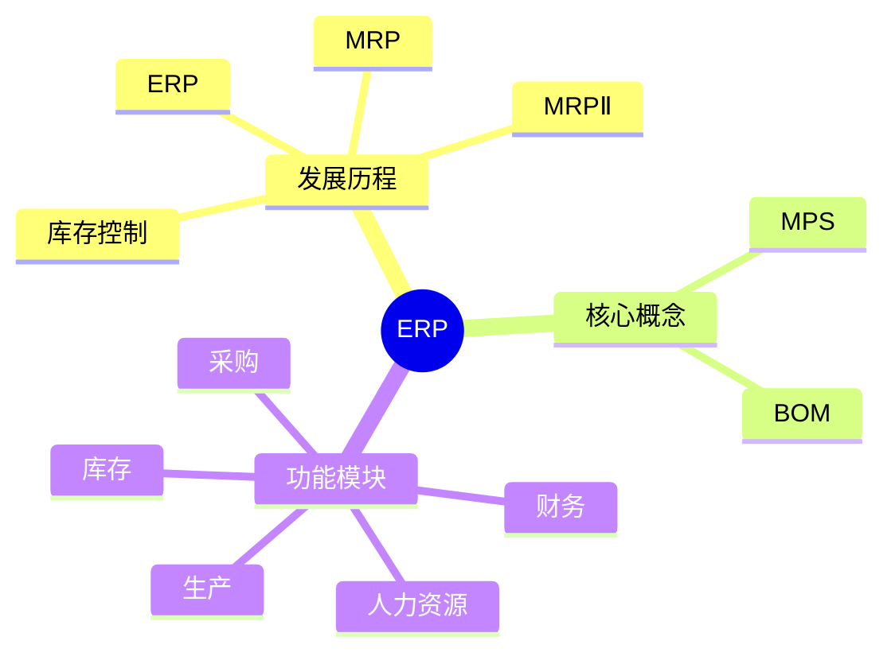

# 第四节 ERP

> 本文依据《8.信息系统基础知识》PDF 中 ERP 相关内容整理与扩展，保持课程原有知识框架，并补充学习辅助内容。

---

## 目录

1. ERP 概述
2. ERP 的发展历程
3. 核心概念（MRP、MRPⅡ、MPS、BOM）
4. ERP 功能模块
5. ERP 特点
6. ERP 实施价值
7. ERP 与其他系统关系
8. 高频考点
9. 易错点
10. Mermaid 思维导图
11. 本节小结

---

## 1. ERP 概述

ERP（Enterprise Resource Planning，企业资源计划）是企业级信息系统，用于统一管理企业的人、财、物、产、供、销等资源，实现业务协同与资源优化。课程资料将 ERP 作为企业信息化的重要组成部分进行介绍。

---

## 2. ERP 的发展历程

课程资料介绍了 ERP 的演进过程：

```text
库存控制
   ↓
MRP（物料需求计划）
   ↓
MRPⅡ（制造资源计划）
   ↓
ERP（企业资源计划）
```

---

## 3. 核心概念

## MRP（Material Requirements Planning）

依据生产计划计算物料需求数量及时间。

## MRPⅡ（Manufacturing Resource Planning）

在 MRP 基础上增加生产能力、设备、资金等资源管理。

## MPS（Master Production Schedule）

主生产计划，是 MRP 的重要输入。

## BOM（Bill of Materials）

物料清单，用于描述产品组成结构，是 MRP 运算的重要依据。

---

## 4. ERP 功能模块

课程资料涉及的典型模块包括：

| 模块 | 作用 |
|---|---|
| 采购管理 | 采购计划、供应商管理 |
| 库存管理 | 库存控制、出入库 |
| 销售管理 | 订单、发货、结算 |
| 生产管理 | 生产计划、制造执行 |
| 财务管理 | 成本、总账、资金 |
| 人力资源 | 人员、薪资、绩效 |

---

## 5. ERP 特点

- 企业资源统一管理
- 数据共享
- 业务流程集成
- 支持跨部门协同
- 提高资源利用率

---

## 6. ERP 实施价值

- 提升管理效率
- 降低库存成本
- 优化生产计划
- 提高决策支持能力
- 加强企业信息化建设

---

## 7. ERP 与其他系统关系

| 系统 | 主要定位 |
|---|---|
| ERP | 企业资源整体管理 |
| CRM | 客户关系管理 |
| SCM | 供应链管理 |
| MES | 生产制造执行 |
| WMS | 仓储管理 |

---

## 8. 高频考点

★★★★★

- MRP → MRPⅡ → ERP 的发展关系
- MPS 与 BOM 的作用
- ERP 功能模块
- ERP 与 CRM、SCM 的区别

---

## 9. 易错点

| 易混概念 | 区别 |
|---|---|
| MRP 与 MRPⅡ | 后者增加制造资源管理 |
| ERP 与 CRM | ERP 管资源，CRM 管客户 |
| ERP 与 SCM | ERP 偏企业内部，SCM 偏供应链协同 |

---

## 10. Mermaid 思维导图



---

## 11. 本节小结

ERP 是考试高频知识点，应重点掌握其发展历程、核心概念（MRP、MRPⅡ、MPS、BOM）、主要功能模块以及与 CRM、SCM 等系统之间的关系。

## 下一节

[下一节：信息系统架构](./06-information-system-architecture)
