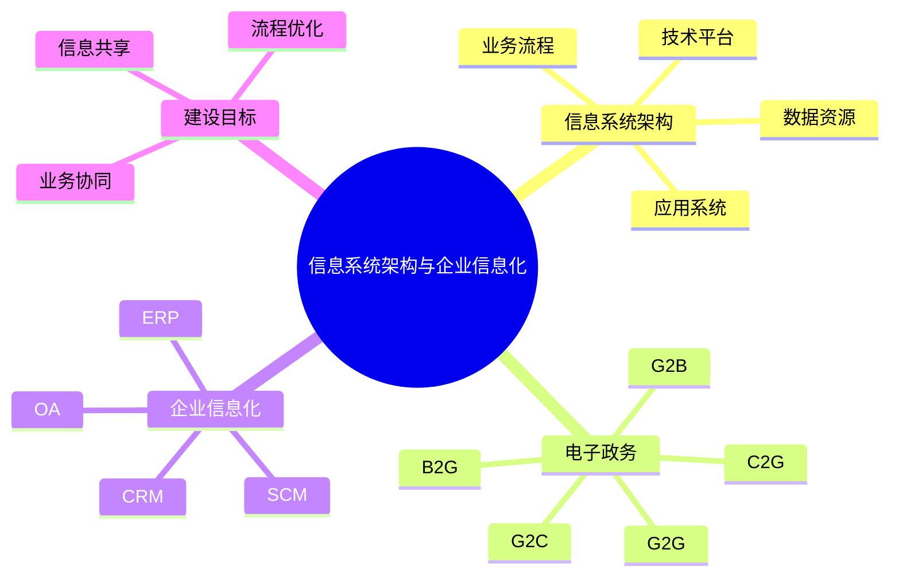

# 第五节 信息系统架构

> 本文依据《8.信息系统基础知识》PDF 中“信息系统架构、电子政务、企业信息化”等内容整理，并在课程框架基础上增加学习辅助内容。

---

## 目录

1. 信息系统架构概述
2. 企业信息化
3. 电子政务模式
4. 企业信息系统架构
5. 企业信息化建设特点
6. 高频考点
7. 易错点
8. Mermaid 思维导图
9. 本节小结

---

## 1. 信息系统架构概述

根据课程资料，信息系统架构用于描述企业信息系统各组成部分之间的关系，为业务、数据、应用和技术提供统一支撑。

信息系统建设通常需要兼顾：

- 业务流程
- 数据资源
- 应用系统
- 技术平台

---

## 2. 企业信息化

企业信息化是利用信息技术提升企业管理效率和竞争力的过程。

课程资料涉及的信息化内容包括：

- 企业业务流程优化
- 信息资源共享
- 系统集成
- 企业管理协同

---

## 3. 电子政务模式

课程资料列出了常见电子政务模式：

| 模式 | 含义 | 服务对象 |
|---|---|---|
| G2G | Government to Government | 政府 ↔ 政府 |
| G2B | Government to Business | 政府 ↔ 企业 |
| G2C | Government to Citizen | 政府 ↔ 公民 |
| B2G | Business to Government | 企业 ↔ 政府 |
| C2G | Citizen to Government | 公民 ↔ 政府 |

---

## 4. 企业信息系统架构

企业通常由多个业务系统组成，例如：

- ERP（企业资源计划）
- CRM（客户关系管理）
- SCM（供应链管理）
- OA（办公自动化）

这些系统共同支撑企业运营，实现数据共享与业务协同。课程资料介绍了企业信息化及相关系统之间的联系。

---

## 5. 企业信息化建设特点

主要特点：

- 信息共享
- 业务协同
- 流程优化
- 决策支持
- 持续改进

---

## 6. 高频考点

★★★★★

- G2G、G2B、G2C 的含义
- B2G、C2G 的区别
- 企业信息化目标
- 常见企业信息系统组成

---

## 7. 易错点

| 易混概念 | 说明 |
|---|---|
| G2B | 政府向企业提供服务 |
| B2G | 企业向政府提供服务 |
| G2C | 政府面向公众 |
| C2G | 公民面向政府 |

---

## 8. Mermaid 思维导图

---

## 9. 本节小结

本节重点掌握电子政务各模式的含义及企业信息化建设的基本思路。考试通常以概念辨析和缩写对应关系进行考查，尤其需要区分 G2B 与 B2G、G2C 与 C2G。

## 下一节

[下一节：信息化战略与战略规划](./07-information-strategy)
