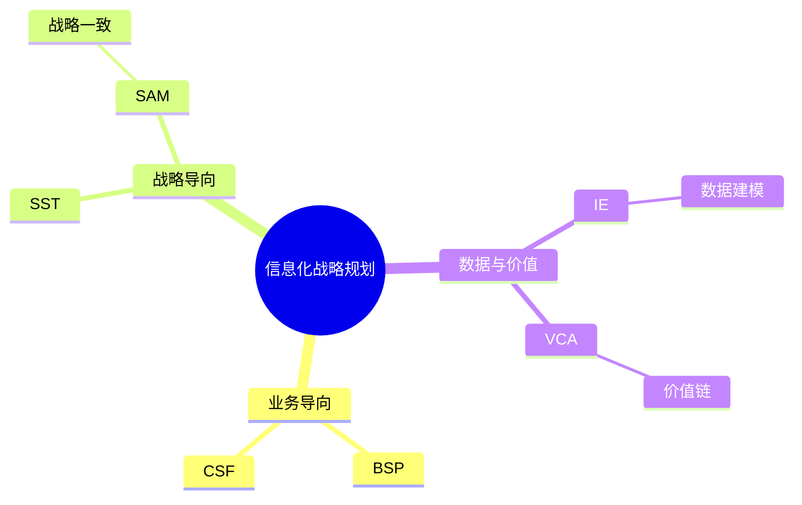

# 第六节 信息化战略与战略规划

> 本文依据《8.信息系统基础知识》PDF 中“信息化战略与战略规划”部分整理，重点围绕 BSP、CSF、SST、IE、VCA、SAM 等方法展开。

---

## 目录

1. 信息化战略概述
2. BSP（Business System Planning）
3. CSF（Critical Success Factors）
4. SST（战略集合转换法）
5. IE（Information Engineering）
6. VCA（Value Chain Analysis）
7. SAM（Strategic Alignment Model）
8. 各方法对比
9. 高频考点
10. 易错点
11. Mermaid 思维导图
12. 本节小结

---

## 1. 信息化战略概述

信息化战略规划用于指导企业信息系统建设，使信息技术与企业发展目标保持一致。

课程资料介绍了多种战略规划方法，其中 BSP、CSF、SST、IE、VCA、SAM 是考试重点。

---

## 2. BSP（Business System Planning）

## 基本思想

BSP（业务系统规划法）强调**从企业业务出发规划信息系统**，先分析业务流程，再确定数据和应用系统。

### 特点

- 业务驱动
- 自顶向下规划
- 建立企业信息系统总体蓝图

### 适用场景

- 大型企业信息化建设
- 企业总体规划

---

## 3. CSF（Critical Success Factors）

## 基本思想

CSF（关键成功因素法）通过识别影响企业成功的关键因素，确定信息系统建设重点。

### 特点

- 聚焦关键目标
- 管理层参与度高
- 适合战略规划

---

## 4. SST（战略集合转换法）

SST 通过分析企业战略目标，将战略逐步转换为信息系统建设需求。

特点：

- 战略导向
- 强调业务与信息化结合
- 支持长期规划

---

## 5. IE（Information Engineering）

IE（信息工程法）强调**数据为中心**进行分析和设计。

主要内容：

- 数据建模
- 数据共享
- 企业级数据库规划
- 系统集成

---

## 6. VCA（Value Chain Analysis）

VCA（价值链分析）通过分析企业价值链活动，寻找信息化提升价值的机会。

关注：

- 基本活动
- 支持活动
- 成本优化
- 竞争优势

---

## 7. SAM（Strategic Alignment Model）

SAM（战略一致性模型）强调企业战略与信息化战略保持一致，实现业务与 IT 协同发展。

---

## 8. 各方法对比

| 方法 | 核心思想 | 关注重点 |
|---|---|---|
| BSP | 业务驱动 | 总体规划 |
| CSF | 关键成功因素 | 管理目标 |
| SST | 战略转换 | 战略落地 |
| IE | 数据中心 | 数据规划 |
| VCA | 价值链 | 竞争优势 |
| SAM | 战略一致 | 业务与 IT 协同 |

---

## 9. 高频考点

★★★★★

- BSP 的核心思想
- CSF 与 BSP 的区别
- IE 的数据中心思想
- VCA 的价值链分析
- SAM 的战略一致性

---

## 10. 易错点

| 易混知识 | 区别 |
|---|---|
| BSP vs CSF | BSP 从业务整体规划；CSF 聚焦关键成功因素 |
| IE vs BSP | IE 更强调数据；BSP 更强调业务 |
| VCA vs SAM | VCA 分析价值链；SAM 强调战略一致 |

---

## 11. Mermaid 思维导图

---

## 12. 本节小结

本节介绍了信息化战略规划的主要方法。考试通常考查各种方法的核心思想、适用场景及区别，其中 BSP、CSF、IE 是高频考点，应重点掌握。

## 下一节

[下一节：CRM](./08-crm)
