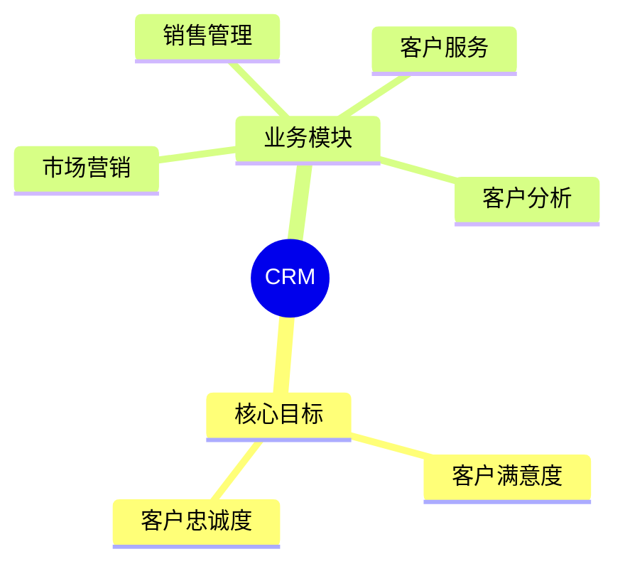

# 第七节 CRM

> 本文依据《8.信息系统基础知识》PDF 中 **CRM（客户关系管理）** 相关内容整理，保持课程原有知识框架，并增加学习辅助内容。

---

## 目录

1. CRM 概述
2. CRM 的目标
3. CRM 的组成
4. CRM 的主要功能
5. CRM 的业务流程
6. CRM 与 ERP、SCM 的关系
7. 高频考点
8. 易错点
9. Mermaid 思维导图
10. 本节小结

---

## 1. CRM 概述

CRM（Customer Relationship Management）即**客户关系管理**，是一种以客户为中心的管理思想，也是企业信息化的重要组成部分。

课程资料强调，CRM 的核心目标是提升客户满意度、增强客户忠诚度，并提高企业经营绩效。

---

## 2. CRM 的目标

CRM 建设通常围绕以下目标展开：

- 建立统一客户信息
- 提高客户满意度
- 提高客户忠诚度
- 提升销售成功率
- 增强企业市场竞争力

---

## 3. CRM 的组成

根据课程内容，CRM 通常包含以下几个方面：

| 模块 | 主要内容 |
|------|----------|
| 市场营销 | 市场活动、客户获取 |
| 销售管理 | 商机、订单、销售过程 |
| 客户服务 | 售前、售中、售后服务 |
| 客户分析 | 数据统计、商业分析 |

---

## 4. CRM 的主要功能

- 客户信息管理
- 联系人管理
- 商机管理
- 销售预测
- 售后服务
- 客户价值分析
- 客户满意度管理

---

## 5. CRM 的业务流程

```text
潜在客户
    ↓
客户开发
    ↓
销售跟进
    ↓
订单成交
    ↓
售后服务
    ↓
客户维护
```

---

## 6. CRM 与 ERP、SCM 的关系

| 系统 | 关注重点 |
|------|----------|
| CRM | 客户关系管理 |
| ERP | 企业内部资源管理 |
| SCM | 供应链协同管理 |

课程资料指出，CRM 常与 ERP 配合，实现客户、订单及资源信息共享。

---

## 7. 高频考点

★★★★★

- CRM 的核心思想
- CRM 的组成模块
- CRM 与 ERP 的关系
- CRM 与 SCM 的区别

---

## 8. 易错点

| 易混知识 | 区别 |
|----------|------|
| CRM vs ERP | CRM 面向客户；ERP 面向企业内部资源 |
| CRM vs SCM | CRM 管客户；SCM 管供应链 |

---

## 9. Mermaid 思维导图



---

## 10. 本节小结

CRM 是企业信息化的重要组成部分，也是考试中的高频知识点。建议重点掌握 CRM 的目标、组成、主要功能，以及与 ERP、SCM 的联系和区别。

## 下一节

[下一节：SCM](./09-scm)
