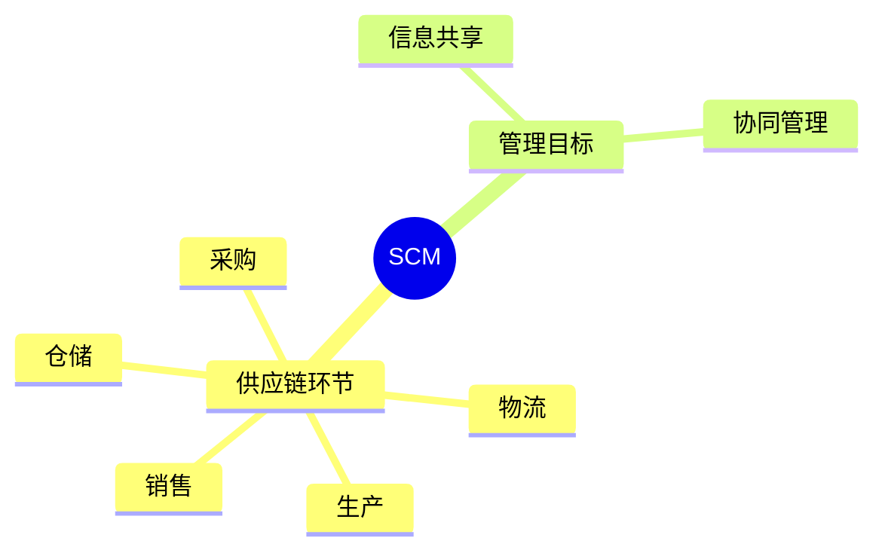

# 第八节 SCM

> 本文依据《8.信息系统基础知识》PDF 中 **SCM（供应链管理）** 相关内容整理，保持课程知识框架，并增加学习辅助内容。

---

## 目录

1. SCM 概述
2. SCM 的目标
3. SCM 的组成
4. SCM 的主要流程
5. SCM 的主要特点
6. SCM 与 ERP、CRM 的关系
7. 高频考点
8. 易错点
9. Mermaid 思维导图
10. 本节小结

---

## 1. SCM 概述

SCM（Supply Chain Management）即**供应链管理**，是对供应商、制造商、仓储、物流、销售以及客户等环节进行统一协调与优化的管理思想。

课程资料指出，SCM 强调供应链整体协同，提高企业整体竞争力。

---

## 2. SCM 的目标

SCM 的主要目标包括：

- 优化供应链流程
- 降低库存成本
- 缩短交付周期
- 提高客户满意度
- 实现企业间协同

---

## 3. SCM 的组成

根据课程资料，SCM 通常涉及以下环节：

| 环节 | 主要内容 |
|------|----------|
| 采购 | 原材料采购、供应商管理 |
| 生产 | 生产计划、制造执行 |
| 仓储 | 库存管理、仓储控制 |
| 物流 | 配送、运输管理 |
| 销售 | 订单履行、客户交付 |

---

## 4. SCM 的主要流程

```text
供应商
   ↓
采购
   ↓
生产制造
   ↓
仓储管理
   ↓
物流配送
   ↓
客户
```

---

## 5. SCM 的主要特点

- 全流程管理
- 企业间协同
- 信息共享
- 降低成本
- 提高响应速度
- 优化库存水平

---

## 6. SCM 与 ERP、CRM 的关系

| 系统 | 主要关注点 |
|------|------------|
| ERP | 企业内部资源管理 |
| CRM | 客户关系管理 |
| SCM | 企业间供应链协同 |

课程资料强调，ERP、CRM、SCM 并非相互替代，而是共同支撑企业信息化建设，实现数据共享和业务协同。

---

## 7. 高频考点

★★★★★

- SCM 的核心思想
- SCM 的主要流程
- SCM 的特点
- SCM 与 ERP、CRM 的区别

---

## 8. 易错点

| 易混知识 | 区别 |
|----------|------|
| SCM vs ERP | SCM 关注供应链整体；ERP 关注企业内部资源 |
| SCM vs CRM | SCM 管供应链；CRM 管客户关系 |

---

## 9. Mermaid 思维导图



---

## 10. 本节小结

SCM 是企业信息化的重要组成部分，也是考试高频知识点。应重点掌握 SCM 的目标、组成、流程及其与 ERP、CRM 的联系和区别。

## 下一节

[下一节：企业应用集成](./10-enterprise-application-integration)
