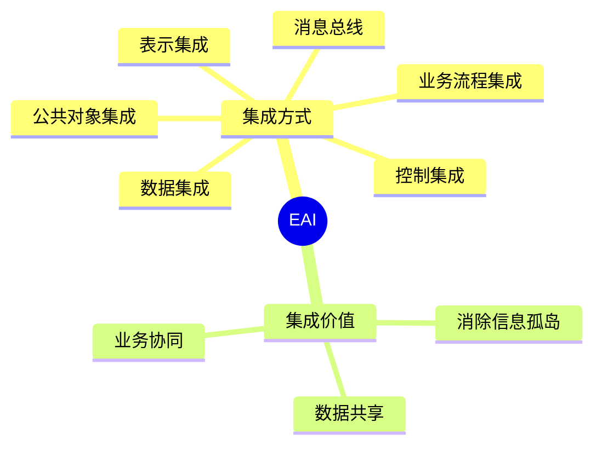

# 第九节 企业应用集成

> 本文依据《8.信息系统基础知识》PDF 中 **企业应用集成（EAI）** 相关内容整理，保持课程原有知识框架，并补充学习辅助内容。

---

## 目录

1. EAI 概述
2. EAI 的产生背景
3. EAI 的主要集成方式
4. EAI 的特点
5. EAI 的价值
6. EAI 与 SOA 的关系
7. 高频考点
8. 易错点
9. Mermaid 思维导图
10. 本节小结

---

## 1. EAI 概述

企业应用集成（Enterprise Application Integration，EAI）是指将企业内部多个独立应用系统连接起来，实现数据共享、业务协同和流程整合。

课程资料将 EAI 作为企业信息化的重要组成部分进行介绍。

---

## 2. EAI 的产生背景

随着企业中 ERP、CRM、SCM、OA 等系统不断增加，形成了大量“信息孤岛”。

EAI 的目标是：

- 消除信息孤岛
- 实现系统互联
- 数据共享
- 统一业务流程
- 提高整体协同效率

---

## 3. EAI 的主要集成方式

根据课程资料，EAI 主要包括以下集成方式：

| 集成方式 | 说明 |
|----------|------|
| 表示集成 | 统一用户界面，实现统一访问 |
| 数据集成 | 实现不同系统间的数据共享 |
| 控制集成 | 协调多个系统之间的调用关系 |
| 业务流程集成 | 将多个系统业务流程串联 |
| 消息总线 | 通过消息机制进行通信 |
| 公共对象集成 | 封装公共业务对象供多个系统共享 |

---

## 4. EAI 的特点

- 系统互联
- 数据共享
- 松耦合集成
- 提高业务协同
- 降低重复开发成本
- 支持企业持续扩展

---

## 5. EAI 的价值

EAI 可以帮助企业：

- 提高业务效率
- 降低维护成本
- 保持系统一致性
- 提高数据利用率
- 支撑数字化转型

---

## 6. EAI 与 SOA 的关系

| EAI | SOA |
|-----|-----|
| 关注企业应用集成 | 关注服务化架构 |
| 强调系统互联 | 强调服务复用 |
| 常用于已有系统整合 | 常用于新系统设计与集成 |

课程资料分别介绍了 SOA 与 EAI，两者均服务于企业信息化建设，但侧重点不同。

---

## 7. 高频考点

★★★★★

- EAI 的定义
- 六种集成方式
- 消息总线的作用
- 公共对象集成
- EAI 与 SOA 的区别

---

## 8. 易错点

| 易混知识 | 区别 |
|----------|------|
| 数据集成 vs 表示集成 | 前者共享数据，后者统一界面 |
| 控制集成 vs 业务流程集成 | 前者协调调用，后者整合业务流程 |
| EAI vs SOA | EAI 偏系统集成；SOA 偏服务架构 |

---

## 9. Mermaid 思维导图

---

## 10. 本节小结

EAI 是企业信息化建设中的重要技术，重点掌握六种集成方式及其区别，并理解 EAI 与 SOA 在应用场景上的不同。考试常以概念辨析和集成方式对应关系进行考查。

## 下一节

[下一节：电子商务](./11-ecommerce)
