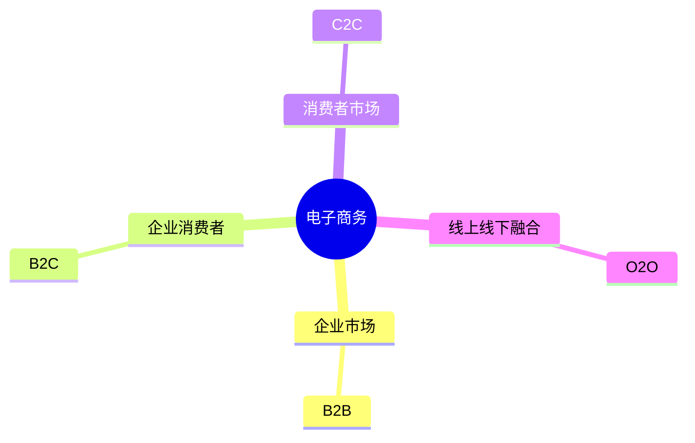

# 第十节 电子商务

> 本文依据《8.信息系统基础知识》PDF 中**电子商务**相关内容整理，保持课程知识框架，并增加学习辅助内容。

---

## 目录

1. 电子商务概述
2. B2B（Business to Business）
3. B2C（Business to Consumer）
4. C2C（Consumer to Consumer）
5. O2O（Online to Offline）
6. 四种模式对比
7. 高频考点
8. 易错点
9. Mermaid 思维导图
10. 本节小结

---

## 1. 电子商务概述

课程资料介绍了电子商务的四种典型模式：

- B2B
- B2C
- C2C
- O2O

考试主要考查各模式的含义、服务对象及应用场景。

---

## 2. B2B（Business to Business）

企业与企业之间开展商品、服务及信息交易。

**特点：**

- 交易金额较大
- 长期合作关系
- 强调供应链协同

**典型场景：**

- 企业采购
- 原材料交易
- 工业品交易

---

## 3. B2C（Business to Consumer）

企业直接面向消费者销售商品或提供服务。

**特点：**

- 面向个人消费者
- 商品种类丰富
- 在线支付、物流配送

---

## 4. C2C（Consumer to Consumer）

消费者之间直接进行商品或服务交易，平台提供撮合服务。

**特点：**

- 用户自主交易
- 平台负责规则与信用管理

---

## 5. O2O（Online to Offline）

线上获取信息、下单或预约，线下完成消费或服务。

**典型应用：**

- 餐饮
- 酒店
- 电影票
- 到店服务

---

## 6. 四种模式对比

| 模式 | 全称 | 交易主体 | 典型特点 |
|------|------|----------|----------|
| B2B | Business to Business | 企业 ↔ 企业 | 企业间交易 |
| B2C | Business to Consumer | 企业 ↔ 消费者 | 网络零售 |
| C2C | Consumer to Consumer | 消费者 ↔ 消费者 | 平台撮合 |
| O2O | Online to Offline | 线上 ↔ 线下 | 线上线下融合 |

---

## 7. 高频考点

★★★★★

- 四种电子商务模式含义
- B2B、B2C、C2C、O2O 区别
- O2O 的特点与应用场景

---

## 8. 易错点

| 易混概念 | 区别 |
|----------|------|
| B2B vs B2C | 企业对企业；企业对消费者 |
| C2C vs B2C | 消费者之间；企业对消费者 |
| O2O | 并非单纯线上交易，而是线上与线下结合 |

---

## 9. Mermaid 思维导图

---

## 10. 本节小结

电子商务部分内容相对集中，以概念辨析为主。重点掌握四种模式的交易主体、应用场景及区别，是考试中的常见得分点。

## 下一节

[下一节：章节练习](./12-exercises)
