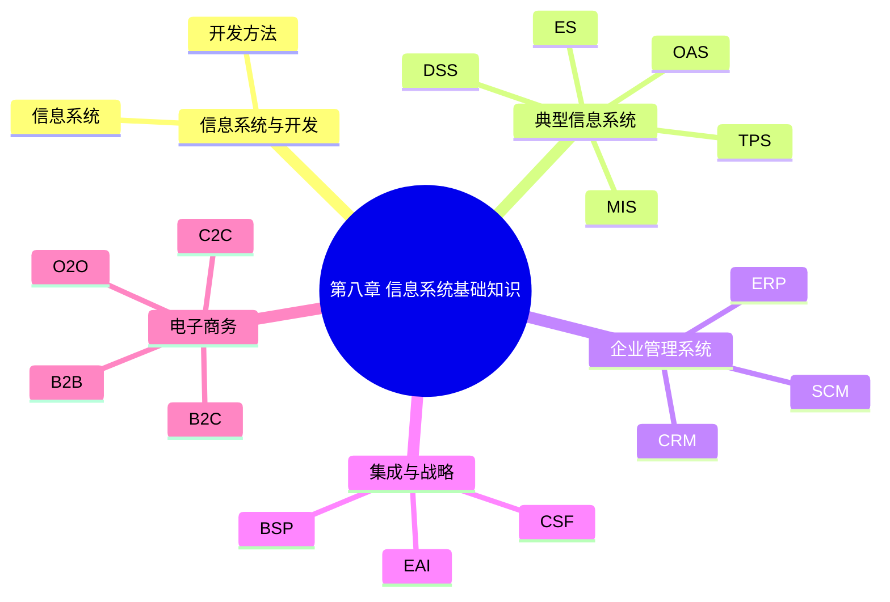

# 第八章总结

> 本文依据《8.信息系统基础知识》PDF 全章内容进行归纳总结，保持课程原有知识体系，并作为第八章的最终复习资料。

---

## 一、本章知识体系

```text
信息系统基础知识
│
├── 信息系统概述
├── 信息系统开发方法
│   ├── 结构化开发（SA/SD）
│   ├── 原型法
│   ├── 面向对象（OO）
│   └── 面向服务（SOA）
│
├── 五大信息系统
│   ├── TPS
│   ├── MIS
│   ├── DSS
│   ├── ES
│   └── OAS
│
├── 企业管理系统
│   ├── ERP
│   ├── CRM
│   └── SCM
│
├── 企业应用集成（EAI）
├── 信息化战略规划
└── 电子商务
    ├── B2B
    ├── B2C
    ├── C2C
    └── O2O
```

---

## 二、必背英文缩写

| 缩写 | 含义 |
|------|------|
| TPS | Transaction Processing System |
| MIS | Management Information System |
| DSS | Decision Support System |
| ES | Expert System |
| OAS | Office Automation System |
| ERP | Enterprise Resource Planning |
| CRM | Customer Relationship Management |
| SCM | Supply Chain Management |
| EAI | Enterprise Application Integration |
| BSP | Business System Planning |
| CSF | Critical Success Factors |
| IE | Information Engineering |
| SAM | Strategic Alignment Model |

---

## 三、易混知识

| 对比 | 区别 |
|------|------|
| TPS vs MIS | 事务处理 vs 管理信息 |
| MIS vs DSS | 管理报表 vs 决策分析 |
| ERP vs CRM | 企业资源 vs 客户关系 |
| ERP vs SCM | 企业内部资源 vs 供应链协同 |
| B2B vs B2C | 企业↔企业 vs 企业↔消费者 |
| G2B vs B2G | 政府服务企业 vs 企业服务政府 |

---

## 四、高频考点（★★★★★）

- 信息系统生命周期
- 四种开发方法
- 五大信息系统对比
- ERP：MRP、MRPⅡ、MPS、BOM
- CRM 与 SCM 的定位
- EAI 六种集成方式
- BSP、CSF 等战略规划方法
- B2B、B2C、C2C、O2O 的区别

以上均为课程资料重点内容。

---

## 五、记忆建议

1. 先掌握英文缩写及中文含义。
2. 重点记忆各种系统的“服务对象”和“核心功能”。
3. 用对比法区分 ERP、CRM、SCM、EAI。
4. 将电子商务模式与电子政务模式分别整理记忆。

---

## 六、Mermaid 思维导图



---

## 七、考前冲刺建议

- 优先复习英文缩写。
- 熟悉五大信息系统和 ERP/CRM/SCM 的区别。
- 重点掌握 EAI 集成方式及战略规划方法。
- 多做课程资料中的历年真题，巩固高频考点。

---

## 八、本章总结

本章覆盖信息系统建设、企业管理系统、战略规划、企业应用集成和电子商务等内容，是软考信息系统部分的重要组成。建议结合前面各 Markdown 文档进行系统复习，重点掌握概念辨析、缩写含义及系统间关系。
