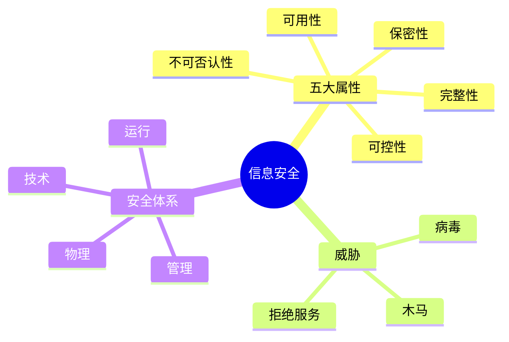

# 01 Information Security Overview（信息安全基础知识）

> 本节依据第九章课件整理，建立信息安全基本概念、安全属性和安全体系。

---

# 目录

1. 信息安全概述
2. 信息安全目标
3. 信息安全五大属性
4. 信息安全威胁
5. 信息安全体系
6. 常见安全措施
7. 高频考点
8. 易错点
9. Mermaid 思维导图
10. 本节小结

---

# 1. 信息安全概述

信息安全（Information Security）是指采取技术和管理措施，保护信息及信息系统免受破坏、泄露、篡改和非法使用，确保信息能够安全、可靠地提供服务。

---

# 2. 信息安全目标

- 保障信息安全
- 保护业务连续运行
- 防止数据泄露
- 防止非法篡改
- 保证合法用户正常访问
- 满足法律法规要求

---

# 3. 信息安全五大属性（★★★★★）

| 属性 | 含义 |
|------|------|
| 保密性（Confidentiality） | 信息只能被授权对象访问 |
| 完整性（Integrity） | 信息未经授权不得修改 |
| 可用性（Availability） | 合法用户能够正常访问资源 |
| 可控性（Controllability） | 对信息传播和使用过程进行控制 |
| 不可否认性（Non-repudiation） | 行为发生后不能否认 |

## 保密性
- 身份认证
- 权限控制
- 数据加密

## 完整性
- 数字摘要
- 数字签名
- 校验码

## 可用性
- 双机热备
- 集群
- 容灾
- UPS

## 可控性
- 权限管理
- 日志审计
- 安全策略

## 不可否认性
- 数字签名
- CA
- PKI

---

# 4. 信息安全威胁

- 非法访问
- 数据泄露
- 数据篡改
- 恶意攻击
- 病毒木马
- 拒绝服务攻击
- 内部违规操作

---

# 5. 信息安全体系

- 管理安全
- 技术安全
- 运行安全
- 物理安全

---

# 6. 常见安全措施

| 安全措施 | 作用 |
|-----------|------|
| 身份认证 | 确认用户身份 |
| 访问控制 | 控制资源访问权限 |
| 数据加密 | 防止泄露 |
| 数字签名 | 防止抵赖 |
| 日志审计 | 追踪安全事件 |
| 备份恢复 | 防止数据丢失 |

---

# 7. 高频考点

- 信息安全五大属性
- 保密性、完整性、可用性的区别
- 不可否认性的实现方式
- 常见安全威胁
- 信息安全体系组成

---

# 8. 易错点

| 易混知识 | 区别 |
|-----------|------|
| 保密性 vs 完整性 | 是否泄露 vs 是否被修改 |
| 完整性 vs 可用性 | 数据正确 vs 能否访问 |
| 可控性 vs 不可否认性 | 控制传播 vs 行为可追溯 |

---

# 9. Mermaid 思维导图

---

# 10. 本节小结

建议优先掌握信息安全五大属性及其典型实现方式，为后续密码学、访问控制、网络安全协议等内容打好基础。
