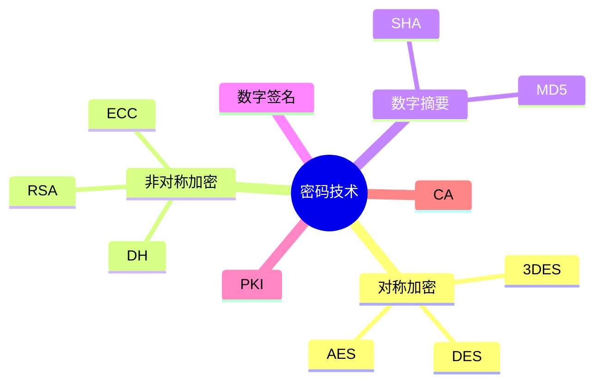

# 第二节 信息安全技术

> 本节依据第九章课件中的密码学内容整理。

---

# 目录

1. 密码学概述
2. 对称加密算法
3. 非对称加密算法
4. 数字摘要
5. 数字签名
6. PKI 与 CA
7. 高频考点
8. 易错点
9. Mermaid 思维导图
10. 本节小结

---

# 1. 密码学概述

密码技术是信息安全的核心技术，主要用于保证：

- 保密性
- 完整性
- 身份认证
- 不可否认性

课程资料重点介绍了对称加密、非对称加密、数字摘要、数字签名以及 PKI 等内容。

---

# 2. 对称加密算法

特点：**加密和解密使用同一密钥**。

| 算法 | 特点 |
|------|------|
| DES | 经典分组加密算法 |
| 3DES | DES 增强版 |
| AES | 当前广泛使用 |
| IDEA | 国际数据加密算法 |
| RC5 | 可变参数加密算法 |

**优点**

- 加密速度快
- 适合大数据加密

**缺点**

- 密钥分发困难

---

# 3. 非对称加密算法

特点：**公钥加密、私钥解密**。

| 算法 | 说明 |
|------|------|
| RSA | 最常考公钥算法 |
| ECC | 椭圆曲线密码 |
| Diffie-Hellman | 密钥交换 |
| ElGamal | 公钥密码算法 |
| Rabin | 非对称加密算法 |

**优点**

- 密钥管理方便
- 支持数字签名

**缺点**

- 运算速度慢

---

# 4. 数字摘要

数字摘要（Hash）用于验证数据完整性。

常见算法：

- MD5
- SHA 系列

特点：

- 固定长度输出
- 单向不可逆
- 输入变化，摘要变化

---

# 5. 数字签名

数字签名用于：

- 身份认证
- 数据完整性验证
- 防止抵赖

典型流程：

```text
原文
 ↓
Hash
 ↓
私钥签名
 ↓
发送

接收方
 ↓
Hash
 ↓
公钥验证
```

---

# 6. PKI 与 CA

## PKI

公钥基础设施（Public Key Infrastructure），用于统一管理数字证书、密钥及身份认证。

## CA

证书认证中心（Certificate Authority）。

主要职责：

- 签发证书
- 管理证书
- 吊销证书
- 验证身份

---

# 7. 高频考点（★★★★★）

- 对称加密与非对称加密区别
- DES、AES、RSA
- 数字摘要用途
- 数字签名流程
- PKI 与 CA

---

# 8. 易错点

| 易混知识 | 区别 |
|----------|------|
| 加密 vs 数字签名 | 加密保密；签名认证 |
| MD5 vs RSA | MD5 为摘要；RSA 为公钥算法 |
| AES vs RSA | AES 对称；RSA 非对称 |

---

# 9. Mermaid 思维导图



---

# 10. 本节小结

密码技术是系统安全章节最重要的内容之一。考试重点围绕加密算法分类、数字摘要、数字签名以及 PKI/CA 展开，应重点掌握各种算法的特点和适用场景。
