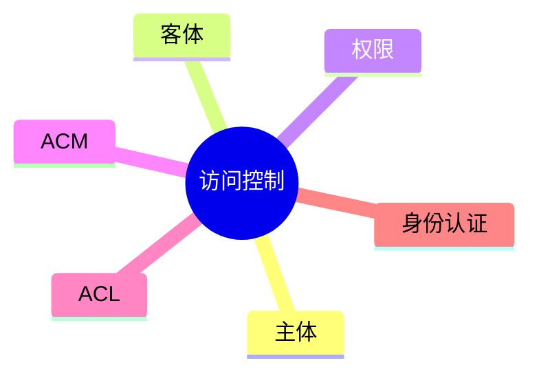

# 第三节 访问控制

> 本节依据第九章课件中的访问控制内容整理。

---

# 目录

1. 访问控制概述
2. 访问控制三要素
3. 访问控制模型
4. ACL（访问控制列表）
5. 身份认证
6. 高频考点
7. 易错点
8. Mermaid 思维导图
9. 本节小结

---

# 1. 访问控制概述

访问控制（Access Control）用于限制主体对客体资源的访问权限，是保障信息安全的重要技术。

课程资料重点介绍了访问控制的基本思想、访问控制矩阵（ACM）以及访问控制列表（ACL）等内容。

---

# 2. 访问控制三要素

| 要素 | 说明 |
|------|------|
| 主体（Subject） | 发起访问的用户、进程等 |
| 客体（Object） | 被访问的资源，如文件、数据库、设备 |
| 权限（Permission） | 主体对客体允许执行的操作 |

常见权限包括：

- Read（读）
- Write（写）
- Execute（执行）
- Delete（删除）

---

# 3. 访问控制模型

课程资料涉及访问控制矩阵（ACM）和访问控制列表（ACL）。

## 访问控制矩阵（ACM）

以矩阵形式表示主体与客体之间的权限关系。

优点：

- 权限关系直观。

缺点：

- 矩阵规模大，不便维护。

## 访问控制列表（ACL）

ACL 为每个客体维护一份授权列表，记录哪些主体可以执行哪些操作。

特点：

- 实现简单
- 应用广泛
- 操作系统、网络设备普遍采用

---

# 4. ACL（访问控制列表）

ACL 记录主体对应的访问权限，例如：

| 主体 | 权限 |
|------|------|
| UserA | Read、Write |
| UserB | Read |
| Admin | Full Control |

ACL 是课程资料中的重点考点之一。

---

# 5. 身份认证

访问控制通常需要身份认证配合完成。

常见认证方式：

- 用户名 + 密码
- 数字证书
- 生物特征认证
- 多因素认证（MFA）

---

# 6. 高频考点（★★★★★）

- 主体、客体、权限
- ACM 与 ACL 的区别
- ACL 的特点
- 身份认证与访问控制的关系

---

# 7. 易错点

| 易混知识 | 区别 |
|----------|------|
| 身份认证 vs 访问控制 | 前者确认身份；后者控制权限 |
| ACM vs ACL | ACM 是矩阵模型；ACL 是客体权限列表 |
| 主体 vs 客体 | 主体发起访问；客体提供资源 |

---

# 8. Mermaid 思维导图

---

# 9. 本节小结

访问控制是系统安全的重要组成部分，应重点掌握主体、客体、权限三要素，以及 ACM、ACL 的基本概念和区别。考试通常以概念辨析和应用场景进行考查。
