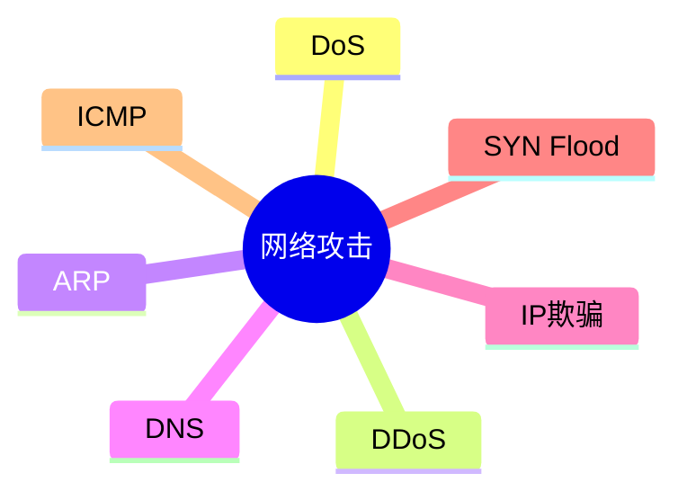

# 第四节 网络攻击与防护

> 本节依据第九章课件中的网络攻击与防护内容整理。

---

# 目录

1. 网络攻击概述
2. DoS 与 DDoS
3. ARP 欺骗
4. DNS 欺骗
5. IP 欺骗
6. SYN Flood
7. ICMP 攻击
8. 常见防护措施
9. 高频考点
10. 易错点
11. Mermaid 思维导图
12. 本节小结

---

# 1. 网络攻击概述

网络攻击是指利用系统、协议或配置中的缺陷，破坏系统正常运行、窃取数据或非法获取资源。

课程资料重点介绍了 ARP 欺骗、DNS 欺骗、IP 欺骗、SYN Flood、ICMP 攻击等典型攻击方式。

---

# 2. DoS 与 DDoS

## DoS（拒绝服务攻击）

攻击者持续消耗目标资源，使合法用户无法获得正常服务。

## DDoS（分布式拒绝服务攻击）

由大量受控主机同时发起攻击，破坏力更强，更难防御。

**特点**

- 消耗带宽
- 消耗服务器资源
- 导致业务不可用

---

# 3. ARP 欺骗

ARP 用于 IP 地址与 MAC 地址之间的映射。

ARP 欺骗通过伪造 ARP 响应，使目标主机建立错误的 IP-MAC 对应关系，从而实现中间人攻击或数据劫持。课程资料介绍了 ARP 工作过程及 ARP 欺骗原理。

**防护措施**

- 静态 ARP
- ARP 防护软件
- 网络设备绑定 IP/MAC

---

# 4. DNS 欺骗

攻击者伪造 DNS 解析结果，使用户访问到错误的网站。

**影响**

- 钓鱼网站
- 信息泄露
- 恶意软件下载

**防护措施**

- 使用可信 DNS
- DNSSEC
- HTTPS 校验

---

# 5. IP 欺骗

攻击者伪造源 IP 地址发起通信，以绕过身份校验或隐藏真实来源。

课程资料结合 TCP 三次握手说明了 IP 欺骗的基本原理。

---

# 6. SYN Flood

SYN Flood 属于 TCP 拒绝服务攻击。

攻击者发送大量 SYN 请求但不完成三次握手，占满服务器半连接队列，导致合法连接无法建立。

**防护措施**

- SYN Cookie
- 增大连接队列
- 防火墙过滤

---

# 7. ICMP 攻击

ICMP 攻击利用 ICMP 报文持续发送 Ping 请求，占用网络资源。

课程资料介绍了 ICMP Flood 等攻击方式。

---

# 8. 常见防护措施

| 攻击 | 常见防护措施 |
|------|--------------|
| DoS / DDoS | 流量清洗、限流、防火墙 |
| ARP 欺骗 | 静态 ARP、IP/MAC 绑定 |
| DNS 欺骗 | DNSSEC、可信 DNS |
| IP 欺骗 | 入口过滤、ACL |
| SYN Flood | SYN Cookie、防火墙 |
| ICMP Flood | 限制 ICMP 流量 |

---

# 9. 高频考点（★★★★★）

- DoS 与 DDoS 区别
- ARP 欺骗原理
- DNS 欺骗特点
- SYN Flood 原理
- 常见攻击对应防护措施

---

# 10. 易错点

| 易混知识 | 区别 |
|----------|------|
| DoS vs DDoS | 单源攻击 vs 多源攻击 |
| ARP 欺骗 vs DNS 欺骗 | 篡改 IP-MAC 映射 vs 篡改域名解析 |
| IP 欺骗 vs SYN Flood | 地址伪造 vs TCP 半连接攻击 |

---

# 11. Mermaid 思维导图

---

# 12. 本节小结

网络攻击与防护是系统安全章节的重要考点。应重点掌握各类攻击的基本原理、危害及典型防护措施，特别是 ARP 欺骗、SYN Flood 和 DDoS 等高频内容。
