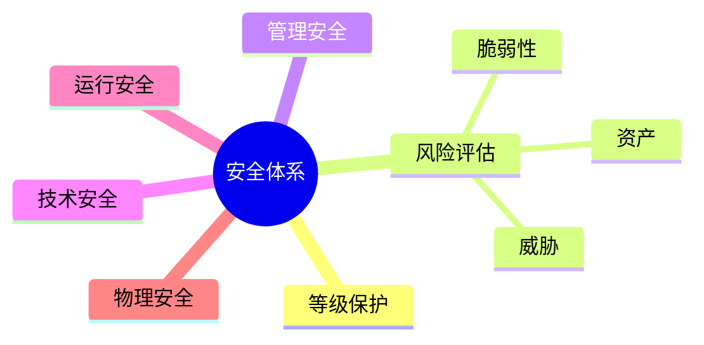

# 第五节 安全体系与等级保护

> 本节依据第九章课件中的安全体系、等级保护和风险评估内容整理。

---

# 目录

1. 安全保障体系概述
2. 信息安全等级保护
3. 风险评估
4. 安全管理体系
5. 安全保障措施
6. 高频考点
7. 易错点
8. Mermaid 思维导图
9. 本节小结

---

# 1. 安全保障体系概述

课程资料介绍了信息安全保障体系的基本思想，即从管理、技术和运行等多个层面保障信息系统安全。

主要目标：

- 保证系统持续运行
- 降低安全风险
- 满足法规要求
- 提升整体安全能力

---

# 2. 信息安全等级保护

课程资料介绍了等级保护制度及其基本思想。

等级保护强调：

- 根据系统重要程度确定安全等级
- 采用与等级相匹配的安全措施
- 持续开展安全建设、测评和整改

重点内容包括：

- 定级
- 建设整改
- 等级测评
- 持续监督

---

# 3. 风险评估

风险评估用于识别影响系统安全的风险因素，为安全建设提供依据。

基本过程：

```text
资产识别
    ↓
威胁识别
    ↓
脆弱性分析
    ↓
风险分析
    ↓
风险处置
```

风险通常由以下因素共同决定：

- 资产价值
- 威胁发生可能性
- 脆弱性
- 安全影响

---

# 4. 安全管理体系

课程资料强调安全不仅依赖技术，还需要完善管理制度。

主要内容：

- 安全策略
- 安全组织
- 人员管理
- 应急响应
- 安全审计
- 持续改进

---

# 5. 安全保障措施

| 类别 | 典型措施 |
|------|----------|
| 管理措施 | 制度、流程、培训 |
| 技术措施 | 防火墙、加密、访问控制 |
| 运行措施 | 日志审计、备份恢复、监控 |
| 物理措施 | 门禁、监控、机房环境 |

---

# 6. 高频考点（★★★★★）

- 等级保护基本思想
- 风险评估流程
- 风险三要素（资产、威胁、脆弱性）
- 安全保障体系组成
- 管理措施与技术措施区别

---

# 7. 易错点

| 易混知识 | 区别 |
|----------|------|
| 风险评估 vs 等级保护 | 前者分析风险；后者实施安全建设 |
| 管理安全 vs 技术安全 | 制度流程；技术手段 |
| 风险 vs 威胁 | 风险是综合结果；威胁是风险来源之一 |

---

# 8. Mermaid 思维导图



---

# 9. 本节小结

安全体系与等级保护是系统安全的重要组成部分。考试重点围绕等级保护思想、风险评估流程以及安全保障体系展开，应重点掌握各组成部分之间的关系和应用场景。
