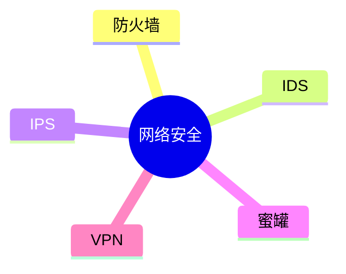

# 第六节 网络安全技术

> 本节依据第九章课件中的网络安全技术内容整理。

---

# 目录

1. 网络安全概述
2. 防火墙（Firewall）
3. IDS（入侵检测系统）
4. IPS（入侵防御系统）
5. 蜜罐（Honeypot）
6. VPN 基本概念
7. 常见网络安全设备对比
8. 高频考点
9. 易错点
10. Mermaid 思维导图
11. 本节小结

---

# 1. 网络安全概述

课程资料介绍了网络安全技术的主要目标：保护网络通信安全，防止非法访问、数据泄露和网络攻击，保障业务连续运行。

---

# 2. 防火墙（Firewall）

防火墙部署在不同网络之间，根据安全策略控制网络通信。

**主要作用：**

- 访问控制
- 数据包过滤
- 网络隔离
- 安全审计

**特点：**

- 第一层网络安全防护
- 不能替代病毒查杀和入侵检测

---

# 3. IDS（入侵检测系统）

IDS（Intrusion Detection System）用于监测网络或主机中的异常行为，并产生告警。

**特点：**

- 发现攻击
- 记录日志
- 不主动阻断攻击

---

# 4. IPS（入侵防御系统）

IPS（Intrusion Prevention System）在检测攻击的同时，可自动采取阻断措施。

**特点：**

- 实时检测
- 主动拦截
- 防止攻击继续传播

---

# 5. 蜜罐（Honeypot）

蜜罐是故意构建的诱骗系统，用于吸引攻击者并收集攻击行为信息。

**主要作用：**

- 攻击取证
- 威胁分析
- 安全研究

---

# 6. VPN 基本概念

VPN（Virtual Private Network）通过加密隧道在公共网络上建立安全通信连接。

**主要特点：**

- 数据加密
- 身份认证
- 安全远程访问

---

# 7. 常见网络安全设备对比

| 技术/设备 | 主要功能 | 是否主动拦截 |
|-----------|----------|--------------|
| 防火墙 | 控制网络访问 | 是（按策略） |
| IDS | 检测攻击并告警 | 否 |
| IPS | 检测并阻断攻击 | 是 |
| 蜜罐 | 诱捕攻击、分析行为 | 否 |
| VPN | 建立安全通信通道 | 不属于攻击检测设备 |

---

# 8. 高频考点（★★★★★）

- 防火墙作用
- IDS 与 IPS 区别
- 蜜罐用途
- VPN 的基本特点
- 各类安全设备应用场景

---

# 9. 易错点

| 易混知识 | 区别 |
|----------|------|
| IDS vs IPS | IDS 负责检测；IPS 检测并阻断 |
| 防火墙 vs IDS | 防火墙控制访问；IDS监测异常 |
| VPN vs 防火墙 | VPN 提供安全通信；防火墙负责访问控制 |

---

# 10. Mermaid 思维导图

---

# 11. 本节小结

网络安全技术是系统安全的重要组成部分。考试重点围绕防火墙、IDS、IPS、蜜罐及 VPN 等技术的作用、特点和区别展开，应重点掌握各技术的典型应用场景。
