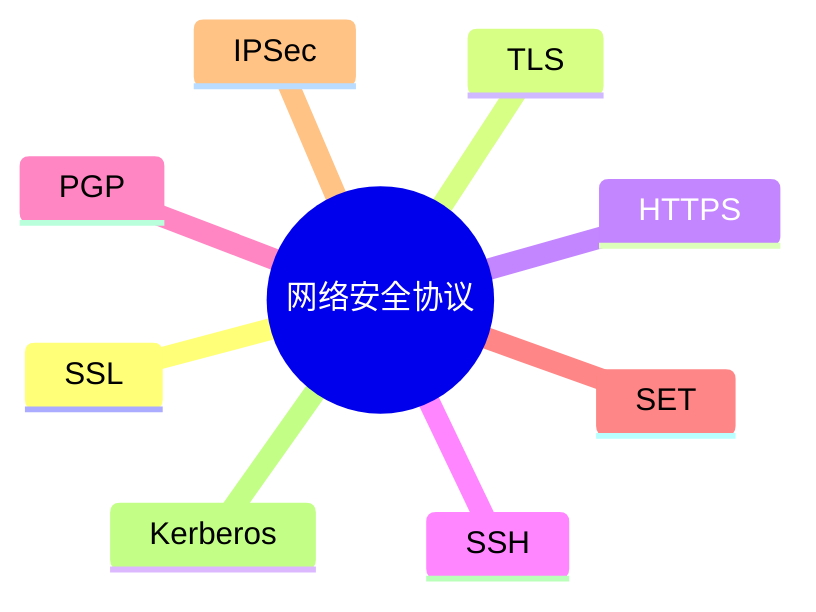

# 第七节 网络安全协议

> 本节依据第九章课件中的网络安全协议内容整理。

---

# 目录

1. 网络安全协议概述
2. SSL / TLS
3. HTTPS
4. SSH
5. PGP
6. SET
7. IPSec
8. Kerberos
9. 协议对比
10. 高频考点
11. 易错点
12. Mermaid 思维导图
13. 本节小结

---

# 1. 网络安全协议概述

网络安全协议用于保障网络通信过程中的机密性、完整性、身份认证及安全传输。

课程资料介绍了 SSL、TLS、HTTPS、SSH、PGP、SET、IPSec、Kerberos 等协议。

---

# 2. SSL / TLS

SSL（Secure Sockets Layer）和 TLS（Transport Layer Security）用于建立安全通信连接。

主要功能：

- 数据加密
- 身份认证
- 数据完整性保护

TLS 是 SSL 的后续发展版本。

---

# 3. HTTPS

HTTPS = HTTP + SSL/TLS。

特点：

- 对 HTTP 通信进行加密
- 使用数字证书验证服务器身份
- 防止窃听和篡改

典型应用：

- 网上银行
- 电商平台
- 登录认证

---

# 4. SSH

SSH（Secure Shell）用于远程安全登录和远程管理。

特点：

- 加密传输
- 身份认证
- 替代 Telnet

---

# 5. PGP

PGP（Pretty Good Privacy）主要用于电子邮件安全。

主要功能：

- 邮件加密
- 数字签名
- 身份认证

---

# 6. SET

SET（Secure Electronic Transaction）用于电子支付安全。

主要特点：

- 保护银行卡支付
- 身份认证
- 支付信息加密

---

# 7. IPSec

IPSec（Internet Protocol Security）工作在网络层，为 IP 通信提供安全保护。

主要功能：

- 身份认证
- 数据加密
- 完整性保护

常用于 VPN。

---

# 8. Kerberos

Kerberos 是基于可信第三方的身份认证协议。

特点：

- 单点登录（SSO）
- 票据（Ticket）认证
- 避免明文传输密码

---

# 9. 协议对比

| 协议 | 主要用途 | 典型应用 |
|------|----------|----------|
| SSL/TLS | 安全通信 | Web 加密 |
| HTTPS | 安全网页 | 网站访问 |
| SSH | 安全远程登录 | 服务器管理 |
| PGP | 邮件安全 | 邮件加密 |
| SET | 安全支付 | 电子商务 |
| IPSec | IP 层安全 | VPN |
| Kerberos | 身份认证 | 企业网络 |

---

# 10. 高频考点（★★★★★）

- SSL 与 TLS 的关系
- HTTPS 的组成
- SSH 的应用场景
- PGP 的用途
- IPSec 与 VPN
- Kerberos 的认证机制

---

# 11. 易错点

| 易混知识 | 区别 |
|----------|------|
| HTTP vs HTTPS | 是否加密 |
| SSL vs TLS | TLS 为后续版本 |
| SSH vs Telnet | SSH 加密；Telnet 明文 |
| IPSec vs SSL/TLS | 网络层安全 vs 传输层安全 |

---

# 12. Mermaid 思维导图

---

# 13. 本节小结

网络安全协议是系统安全的重要考点，应重点掌握各协议的主要用途、工作层次及典型应用场景，尤其注意 HTTPS、SSH、IPSec 与 Kerberos 等高频内容。
