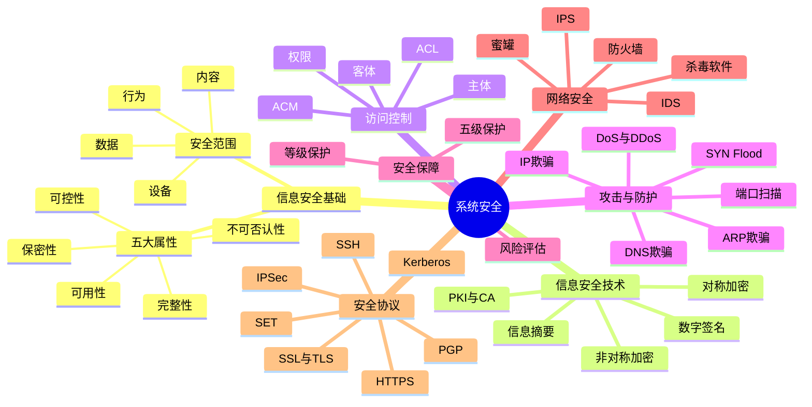

# 第九章总结

## 一页知识图

## 必背清单

### 信息安全属性

| 属性 | 重点记忆 |
| --- | --- |
| 保密性 | 防止未授权泄露，常用身份认证、访问控制和加密 |
| 完整性 | 防止未授权修改或破坏，常用摘要、签名和校验 |
| 可用性 | 合法用户能够正常访问，常用集群、容灾、备份和 UPS |
| 可控性 | 控制信息传播和使用范围，依靠策略、权限和审计 |
| 不可否认性 | 行为发生后不能抵赖，依靠数字签名、CA 和 PKI |

### 密码技术

- 对称加密：同一密钥加解密，速度快，适合大量数据；DES、3DES、AES、IDEA、RC5。
- 非对称加密：公钥和私钥成对使用，便于密钥管理并支持签名；RSA、ECC、Diffie-Hellman、ElGamal、Rabin。
- 信息摘要：固定长度、单向不可逆，用于完整性校验；MD5、SHA。
- 数字签名：发送方用私钥签名，接收方用发送方公钥验证，提供身份认证、完整性和不可否认性。
- 数字信封：用对称密钥加密正文，再用接收方公钥加密对称密钥，兼顾效率和密钥分发。

### 攻击与防护

| 攻击 | 关键原理 | 典型防护 |
| --- | --- | --- |
| ARP 欺骗 | 伪造 IP-MAC 映射 | 静态 ARP、绑定、ARP 防护 |
| DNS 欺骗 | 返回错误域名解析结果 | 可信 DNS、DNSSEC、HTTPS |
| IP 欺骗 | 伪造源 IP | 入口过滤、ACL、防火墙 |
| SYN Flood | 大量半连接占满队列 | SYN Cookie、限流、过滤 |
| DoS/DDoS | 消耗带宽或系统资源 | 清洗、限流、扩容、监控 |

### 网络协议与设备

| 名称 | 主要用途 |
| --- | --- |
| 防火墙 | 按安全策略控制网络访问 |
| IDS | 监测并告警，不主动阻断 |
| IPS | 检测并主动阻断攻击 |
| SSL/TLS | 建立安全传输连接 |
| HTTPS | HTTP 加 SSL/TLS，端口通常为 443 |
| SSH | 安全远程登录，替代明文 Telnet |
| PGP | 电子邮件加密和签名 |
| SET | 电子支付安全 |
| IPSec | 网络层 IP 通信安全，常用于 VPN |
| Kerberos | 基于可信第三方和票据的身份认证 |

## 考前快速辨析

1. “只能授权对象访问”是保密性；“不能被非法修改”是完整性。
2. 加密解决保密，摘要解决完整性校验，签名还要解决身份认证和不可否认性。
3. IDS 只检测告警，IPS 检测后可以阻断；防火墙按策略控制访问。
4. 远程登录想 SSH；邮件想 PGP；IP 层 VPN 想 IPSec；网页加密想 HTTPS。
5. 看到 SYN、半连接队列和三次握手，优先判断 SYN Flood。

## 复习顺序

先背五大属性和密码技术，再用攻击—防护对照表记忆网络安全，最后通过协议用途和真题完成查漏补缺。

## 后续

第十章内容待后续建设。
