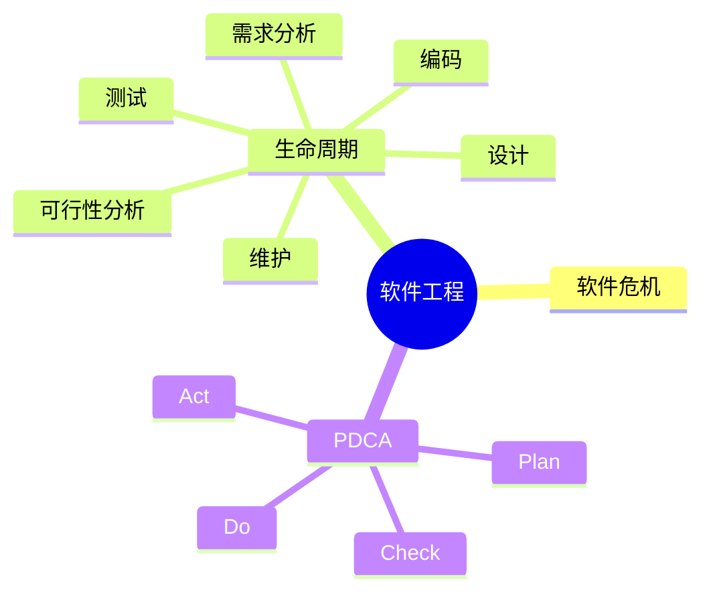

# 第二节 软件工程概述

> 本节依据第十章课件中的软件工程概述整理。

---

# 目录

1. 软件工程概述
2. 软件的特点
3. 软件危机
4. 软件工程目标
5. 软件生命周期
6. PDCA 持续改进
7. 高频考点
8. 易错点
9. Mermaid 思维导图
10. 本节小结

---

# 1. 软件工程概述

软件工程（Software Engineering）是采用工程化的方法、原则和工具，对软件开发、运行与维护进行系统化管理，以提高软件质量和开发效率。

课程资料首先介绍了软件工程的基本概念、目标以及生命周期，是后续各知识点的基础。

---

# 2. 软件的特点

软件具有以下典型特点：

- 不属于有形产品
- 通过开发而非制造形成
- 不会因使用而磨损
- 维护成本高
- 复杂度高

---

# 3. 软件危机

软件危机主要表现为：

- 开发周期长
- 成本超预算
- 软件质量低
- 难维护
- 用户满意度低

软件工程的提出正是为了解决软件危机。

---

# 4. 软件工程目标

主要目标包括：

- 提高软件质量
- 提高开发效率
- 控制开发成本
- 提高可维护性
- 满足用户需求

---

# 5. 软件生命周期

课程资料介绍的软件生命周期主要包括：

```text
可行性分析
    ↓
需求分析
    ↓
设计
    ↓
编码
    ↓
测试
    ↓
运行维护
```

软件生命周期贯穿整个软件开发过程。

---

# 6. PDCA 持续改进

PDCA 循环包括：

| 阶段 | 含义 |
|------|------|
| Plan | 计划 |
| Do | 执行 |
| Check | 检查 |
| Act | 改进 |

PDCA 常用于软件过程持续改进。

---

# 7. 高频考点（★★★★★）

- 软件工程定义
- 软件危机
- 软件生命周期
- 生命周期各阶段
- PDCA 循环

---

# 8. 易错点

| 易混知识 | 区别 |
|----------|------|
| 软件开发生命周期 vs 软件生命周期 | 考试中通常结合课程资料理解各阶段含义 |
| 软件危机 vs 软件缺陷 | 危机是整体开发问题；缺陷是具体软件问题 |
| PDCA vs 软件生命周期 | PDCA 用于持续改进；生命周期用于开发过程 |

---

# 9. Mermaid 思维导图



---

# 10. 本节小结

软件工程概述是整个第十章的基础，应重点掌握软件工程的定义、软件危机、软件生命周期及 PDCA 循环，为后续学习 CMM/CMMI、软件过程模型、需求工程和软件测试等内容奠定基础。
