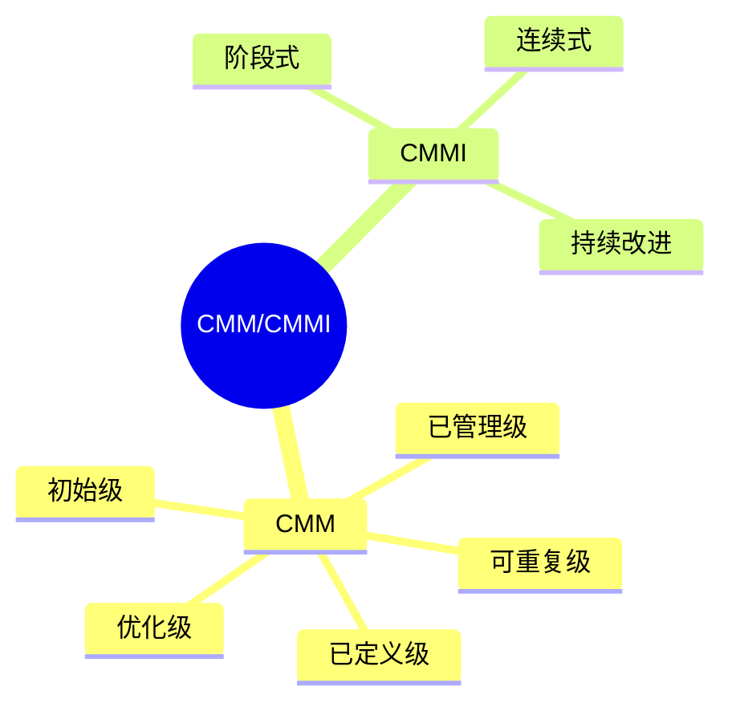

# 第三节 CMM 与 CMMI

> 本节依据第十章课件中的 CMM / CMMI 内容整理。

---

# 目录

1. CMM 概述
2. CMM 五个成熟度等级
3. CMMI 概述
4. CMM 与 CMMI 对比
5. 实施意义
6. 高频考点
7. 易错点
8. Mermaid 思维导图
9. 本节小结

---

# 1. CMM 概述

CMM（Capability Maturity Model，能力成熟度模型）用于评价软件组织的软件过程成熟程度，并指导软件过程持续改进。

课程资料将 CMM 作为软件过程改进的重要模型进行介绍。

---

# 2. CMM 五个成熟度等级（★★★★★）

| 等级 | 名称 | 特点 |
|------|------|------|
| Level 1 | 初始级（Initial） | 过程无序，依赖个人能力 |
| Level 2 | 可重复级（Repeatable） | 建立基本项目管理能力 |
| Level 3 | 已定义级（Defined） | 建立组织级标准过程 |
| Level 4 | 已管理级（Managed） | 过程量化管理 |
| Level 5 | 优化级（Optimizing） | 持续过程改进 |

**记忆口诀：**

> 初始 → 可重复 → 已定义 → 已管理 → 优化

---

# 3. CMMI 概述

CMMI（Capability Maturity Model Integration，能力成熟度模型集成）是在 CMM 基础上的发展，用于统一和改进组织过程能力。

课程资料介绍了 CMMI 的连续式与阶段式表示，并强调其适用于软件过程持续改进。

---

# 4. CMM 与 CMMI 对比

| 对比项 | CMM | CMMI |
|---------|-----|------|
| 定位 | 能力成熟度模型 | 能力成熟度模型集成 |
| 覆盖范围 | 单一模型 | 多模型集成 |
| 改进方式 | 成熟度等级 | 支持阶段式/连续式改进 |

---

# 5. 实施意义

实施 CMM/CMMI 有助于：

- 提高软件质量
- 规范开发流程
- 降低项目风险
- 提高管理水平
- 持续优化软件过程

---

# 6. 高频考点（★★★★★）

- CMM 五级模型
- 各成熟度等级特点
- CMM 与 CMMI 的区别
- CMMI 的作用

---

# 7. 易错点

| 易混知识 | 区别 |
|----------|------|
| CMM vs CMMI | CMMI 是 CMM 的发展与集成 |
| 已定义级 vs 已管理级 | 已定义强调标准化；已管理强调量化管理 |
| 可重复级 vs 优化级 | 基础项目管理；持续改进 |

---

# 8. Mermaid 思维导图

---

# 9. 本节小结

CMM/CMMI 是软件工程的重要考点。应重点掌握 CMM 五个成熟度等级及其特点，并理解 CMMI 在软件过程持续改进中的作用。
