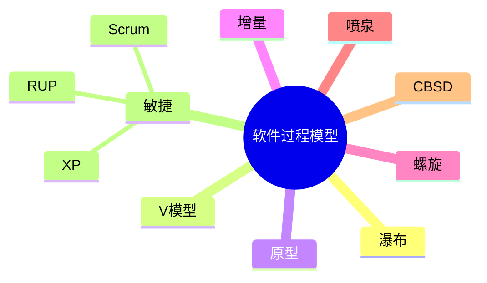

# 第四节 软件过程模型

> 本节依据第十章课件中的软件过程模型整理。

---

# 目录

1. 软件过程模型概述
2. 瀑布模型
3. V 模型
4. 原型模型
5. 增量模型
6. 螺旋模型
7. 喷泉模型
8. 构件组装模型（CBSD）
9. 敏捷开发
10. XP、Scrum、RUP
11. 模型对比
12. 高频考点
13. 易错点
14. Mermaid 思维导图
15. 本节小结

---

# 1. 软件过程模型概述

软件过程模型用于描述软件开发过程中各阶段的组织方式和执行流程，是软件工程的重要基础。课程资料重点介绍了传统模型、演化模型及敏捷开发模型。

---

# 2. 瀑布模型（Waterfall）

特点：

- 阶段顺序执行
- 上一阶段完成后进入下一阶段
- 文档规范、管理简单

适用场景：

- 需求明确、变化较少的项目

缺点：

- 难以适应需求变化

---

# 3. V 模型

V 模型强调**开发阶段与测试阶段一一对应**。

| 开发阶段 | 对应测试 |
|----------|----------|
| 需求分析 | 验收测试 |
| 概要设计 | 系统测试 |
| 详细设计 | 集成测试 |
| 编码 | 单元测试 |

---

# 4. 原型模型（Prototype）

特点：

- 快速构建原型
- 用户参与程度高
- 适用于需求不明确的项目

优点：

- 快速确认需求

缺点：

- 易导致原型直接演变为正式系统

---

# 5. 增量模型（Incremental）

将系统划分为多个可独立交付的增量，每次交付部分功能。

优点：

- 快速交付
- 风险较低
- 易于迭代

---

# 6. 螺旋模型（Spiral）

特点：

- 风险驱动
- 迭代开发
- 每轮包含计划、风险分析、开发、评审

适用于：

- 大型、高风险项目

---

# 7. 喷泉模型（Fountain）

特点：

- 面向对象开发
- 各阶段可交叉、反复进行
- 支持迭代

---

# 8. 构件组装模型（CBSD）

通过复用已有构件快速构建系统。

优点：

- 提高开发效率
- 降低成本
- 增强复用性

---

# 9. 敏捷开发（Agile）

强调：

- 快速响应变化
- 持续交付
- 客户协作
- 小步迭代

---

# 10. XP、Scrum、RUP

- **XP（Extreme Programming）**：结对编程、持续集成、测试驱动。
- **Scrum**：产品待办列表、Sprint、每日站会。
- **RUP（Rational Unified Process）**：迭代开发，包含初始、细化、构建、移交四个阶段。

---

# 11. 模型对比

| 模型 | 主要特点 | 适用场景 |
|------|----------|----------|
| 瀑布 | 顺序开发 | 需求稳定 |
| V | 开发测试对应 | 质量要求高 |
| 原型 | 快速验证需求 | 需求不明确 |
| 增量 | 分阶段交付 | 快速上线 |
| 螺旋 | 风险驱动 | 大型复杂项目 |
| 喷泉 | 面向对象、迭代 | OO 开发 |
| CBSD | 构件复用 | 构件丰富项目 |
| 敏捷 | 快速迭代 | 需求变化频繁 |

---

# 12. 高频考点（★★★★★）

- 各软件过程模型特点
- V 模型测试对应关系
- 原型模型适用场景
- 螺旋模型风险分析
- 敏捷开发特点
- XP、Scrum、RUP 区别

---

# 13. 易错点

| 易混知识 | 区别 |
|----------|------|
| 瀑布 vs V | V 增强测试对应关系 |
| 原型 vs 增量 | 原型验证需求；增量逐步交付 |
| 螺旋 vs 敏捷 | 风险驱动；快速响应变化 |

---

# 14. Mermaid 思维导图

---

# 15. 本节小结

软件过程模型是软件工程章节的核心内容。应重点掌握各模型的特点、适用场景及区别，尤其是瀑布模型、V 模型、原型模型、螺旋模型和敏捷开发等高频考点。
