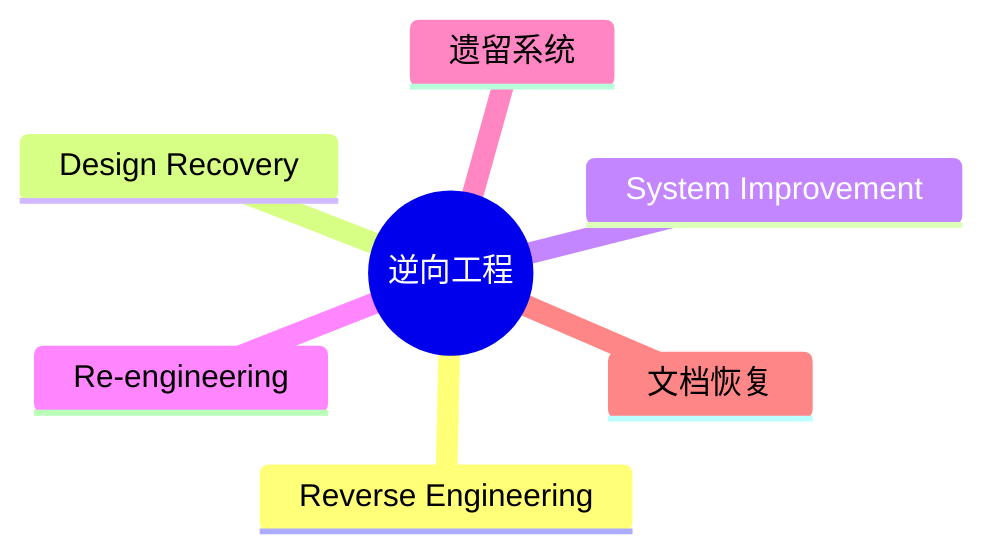

# 第五节 逆向工程

> 本文依据《第十章 软件工程》PDF 中**逆向工程、设计恢复、系统改进、再工程**相关内容整理，保持课程原有知识框架，不扩展资料之外内容。

---

# 目录

1. 逆向工程概述
2. 逆向工程相关概念
3. 再工程（Re-engineering）
4. 正向工程与逆向工程
5. 应用场景
6. 高频考点
7. 易错点
8. Mermaid 思维导图
9. 本节小结

---

# 1. 逆向工程概述

逆向工程（Reverse Engineering）是指从已有的软件系统出发，通过分析程序、数据和文档，恢复系统设计、结构和需求信息的过程。

课程资料介绍了逆向工程、设计恢复（Design Recovery）、系统改进（System Improvement）和再工程（Re-engineering）之间的关系。

---

# 2. 逆向工程相关概念

| 概念 | 说明 |
|------|------|
| Reverse Engineering | 从实现恢复设计信息 |
| Design Recovery | 在逆向分析基础上恢复设计意图 |
| System Improvement | 在原系统基础上进行局部改进 |
| Re-engineering | 对系统进行重新分析、改造和重建 |

---

# 3. 再工程（Re-engineering）

再工程是在充分利用原有系统资产的基础上，对系统进行分析、改造与优化。

主要目标：

- 提高可维护性
- 提升软件质量
- 延长系统生命周期
- 降低维护成本

---

# 4. 正向工程与逆向工程

| 对比项 | 正向工程 | 逆向工程 |
|--------|----------|----------|
| 起点 | 需求与设计 | 已有软件 |
| 目标 | 开发新系统 | 恢复设计与理解系统 |
| 输出 | 软件产品 | 设计文档、模型、结构信息 |

---

# 5. 应用场景

- 遗留系统维护
- 缺失文档恢复
- 系统升级改造
- 软件重构前分析
- 再工程实施

---

# 6. 高频考点（★★★★★）

- Reverse Engineering 定义
- Design Recovery 与 Reverse Engineering 区别
- Re-engineering 含义
- 正向工程与逆向工程比较

---

# 7. 易错点

| 易混知识 | 区别 |
|----------|------|
| Reverse Engineering vs Design Recovery | 前者恢复结构；后者进一步恢复设计意图 |
| System Improvement vs Re-engineering | 局部改进；整体分析与改造 |
| 正向工程 vs 逆向工程 | 从需求开发；从已有系统恢复 |

---

# 8. Mermaid 思维导图

---

# 9. 本节小结

逆向工程是软件维护与系统演化的重要技术。考试重点在于区分 Reverse Engineering、Design Recovery、System Improvement 和 Re-engineering 的概念及应用场景，并理解其与正向工程的区别。
