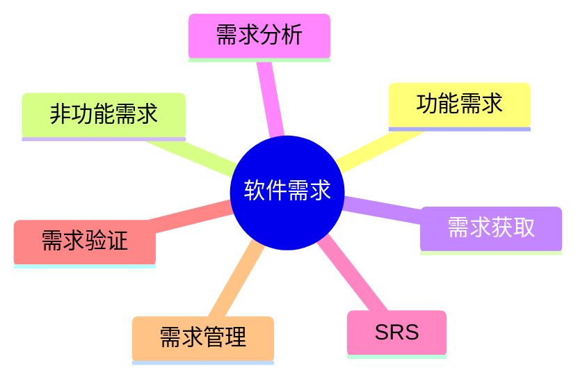

# 第六节 软件需求

> 本文依据《第十章 软件工程》PDF 中**软件需求**相关内容整理，保持课程原有知识框架，不扩展资料之外内容。

---

# 目录

1. 软件需求概述
2. 软件需求分类
3. 功能需求与非功能需求
4. 需求工程基本流程
5. 软件需求的重要性
6. 高频考点
7. 易错点
8. Mermaid 思维导图
9. 本节小结

---

# 1. 软件需求概述

软件需求是指用户对软件系统功能、性能及其他约束条件的描述，是软件开发的基础。

课程资料将需求工程作为软件生命周期中的关键环节，并介绍了需求获取、分析、定义、验证和管理等内容。

---

# 2. 软件需求分类

根据课程资料，软件需求通常包括：

| 类型 | 说明 |
|------|------|
| 功能需求 | 系统需要完成的业务功能 |
| 非功能需求 | 性能、安全性、可靠性、可维护性等质量要求 |
| 约束条件 | 技术、标准、法律及运行环境限制 |

---

# 3. 功能需求与非功能需求

## 功能需求

描述**系统做什么**，例如：

- 用户登录
- 查询数据
- 订单管理
- 报表生成

## 非功能需求

描述**系统应达到什么质量要求**，例如：

- 响应时间
- 可用性
- 安全性
- 可扩展性
- 易维护性

---

# 4. 需求工程基本流程

```text
需求获取
    ↓
需求分析
    ↓
需求定义（SRS）
    ↓
需求验证
    ↓
需求管理
```

课程资料后续章节将分别介绍上述各阶段。

---

# 5. 软件需求的重要性

需求质量直接影响项目成功。

主要作用：

- 明确项目目标
- 降低开发风险
- 提高软件质量
- 控制开发成本
- 为设计、编码、测试提供依据

---

# 6. 高频考点（★★★★★）

- 软件需求定义
- 功能需求与非功能需求区别
- 需求工程流程
- SRS（软件需求规格说明书）的作用

---

# 7. 易错点

| 易混知识 | 区别 |
|----------|------|
| 功能需求 vs 非功能需求 | 做什么 vs 做到什么程度 |
| 需求分析 vs 需求定义 | 分析需求；形成规格说明 |
| 用户需求 vs 软件需求 | 用户业务期望；系统实现要求 |

---

# 8. Mermaid 思维导图



---

# 9. 本节小结

软件需求是软件工程的基础。考试重点围绕需求分类、需求工程流程及 SRS 展开，应掌握功能需求与非功能需求的区别，并理解需求工程各阶段之间的关系。
