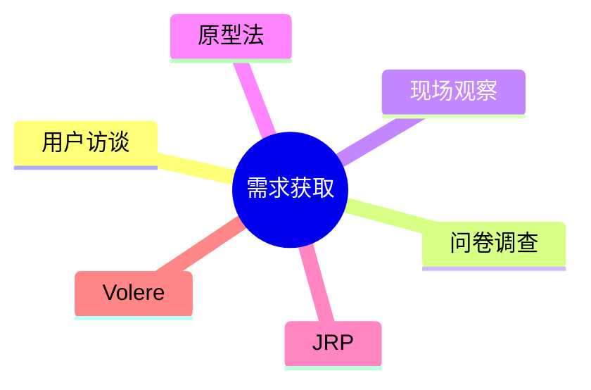

# 第七节 需求获取

> 本文依据《第十章 软件工程》PDF 中**需求获取**相关内容整理，保持课程原有知识框架，不扩展资料之外内容。

---

# 目录

1. 需求获取概述
2. 需求获取目标
3. 常见需求获取方法
4. JRP（联合需求计划）
5. Volere 方法
6. 需求获取注意事项
7. 高频考点
8. 易错点
9. Mermaid 思维导图
10. 本节小结

---

# 1. 需求获取概述

需求获取（Requirements Acquisition）是需求工程的第一步，通过与利益相关者沟通，收集并明确系统需求，为后续需求分析、定义和验证提供基础。课程资料介绍了需求获取的主要方法及适用场景。

---

# 2. 需求获取目标

- 明确业务目标
- 识别用户需求
- 发现约束条件
- 为需求规格说明（SRS）提供依据

---

# 3. 常见需求获取方法

| 方法 | 特点 | 适用场景 |
|------|------|----------|
| 用户访谈 | 深入了解需求 | 关键用户 |
| 问卷调查 | 覆盖面广 | 用户数量较多 |
| 现场观察 | 获取真实业务流程 | 业务复杂 |
| 原型法 | 快速验证需求 | 需求不明确 |
| 文档分析 | 利用现有资料 | 遗留系统 |

---

# 4. JRP（联合需求计划）

JRP（Joint Requirements Planning）通过组织用户、业务专家和开发人员集中讨论，快速梳理并确认需求。

特点：

- 多方共同参与
- 沟通效率高
- 缩短需求确认周期

课程资料将 JRP 作为需求获取的重要方法之一。

---

# 5. Volere 方法

Volere 是一种需求工程方法，强调以标准化模板记录需求，提高需求完整性和可追踪性。

课程资料对 Volere 作了简介。

---

# 6. 需求获取注意事项

- 明确利益相关者
- 保持沟通一致
- 避免歧义
- 完整记录需求
- 及时确认需求

---

# 7. 高频考点（★★★★★）

- 需求获取定义
- JRP 特点
- Volere 方法
- 原型法适用场景
- 各需求获取方法比较

---

# 8. 易错点

| 易混知识 | 区别 |
|----------|------|
| 需求获取 vs 需求分析 | 获取需求；分析整理需求 |
| JRP vs 原型法 | 集中讨论；快速构建原型 |
| Volere vs SRS | 方法体系；需求规格说明文档 |

---

# 9. Mermaid 思维导图

---

# 10. 本节小结

需求获取是需求工程的重要起点。考试重点围绕需求获取方法、JRP、Volere 以及原型法展开，应理解不同方法的特点及适用场景。
