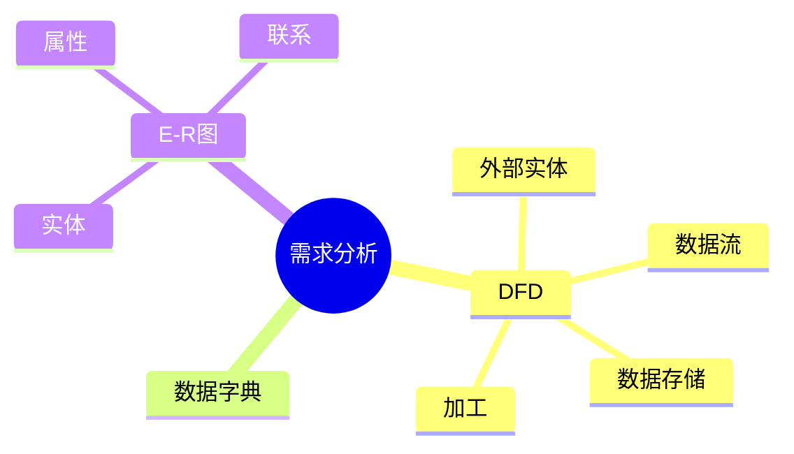

# 第八节 需求分析

> 本文依据《第十章 软件工程》PDF 中**需求分析**相关内容整理，保持课程原有知识框架，不扩展资料之外内容。

---

# 目录

1. 需求分析概述
2. 需求分析目标
3. 数据流图（DFD）
4. 数据字典（DD）
5. E-R 图
6. 需求分析模型
7. 高频考点
8. 易错点
9. Mermaid 思维导图
10. 本节小结

---

# 1. 需求分析概述

需求分析是在需求获取的基础上，对需求进行整理、建模和确认，形成开发人员能够理解和实现的软件需求模型。

课程资料重点介绍了 DFD、数据字典（DD）和 E-R 图等分析工具。

---

# 2. 需求分析目标

- 消除需求歧义
- 建立统一需求模型
- 描述系统业务流程
- 为系统设计提供依据

---

# 3. 数据流图（DFD）

DFD（Data Flow Diagram）用于描述系统中数据的流动及处理过程。

## 四个基本元素

| 元素 | 含义 |
|------|------|
| 外部实体 | 系统外部的数据来源或去向 |
| 数据流 | 数据传递方向 |
| 数据存储 | 数据保存位置 |
| 加工（处理） | 对数据进行处理的过程 |

DFD 是历年考试的重要考点。

---

# 4. 数据字典（DD）

数据字典（Data Dictionary）用于定义 DFD 中涉及的数据元素、数据结构、数据流及存储等内容。

主要作用：

- 统一数据定义
- 消除理解差异
- 支撑系统设计

---

# 5. E-R 图

E-R（Entity-Relationship）图用于描述数据模型。

基本组成：

| 元素 | 含义 |
|------|------|
| 实体（Entity） | 客观存在的对象 |
| 属性（Attribute） | 实体的特征 |
| 联系（Relationship） | 实体之间的关系 |

---

# 6. 需求分析模型

课程资料介绍的需求分析模型主要包括：

- DFD
- 数据字典（DD）
- E-R 图

三者共同用于描述系统业务流程和数据结构。

---

# 7. 高频考点（★★★★★）

- DFD 四个基本元素
- 数据字典作用
- E-R 图组成
- DFD 与 E-R 图区别

---

# 8. 易错点

| 易混知识 | 区别 |
|----------|------|
| DFD vs E-R 图 | DFD 描述数据流；E-R 图描述数据结构 |
| 数据流 vs 数据存储 | 流动的数据；保存的数据 |
| 外部实体 vs 加工 | 数据来源/去向；数据处理过程 |

---

# 9. Mermaid 思维导图

---

# 10. 本节小结

需求分析是需求工程的核心环节。考试重点围绕 DFD、数据字典和 E-R 图展开，应重点掌握 DFD 四要素及 E-R 图三要素，并理解三种分析工具的不同作用。
