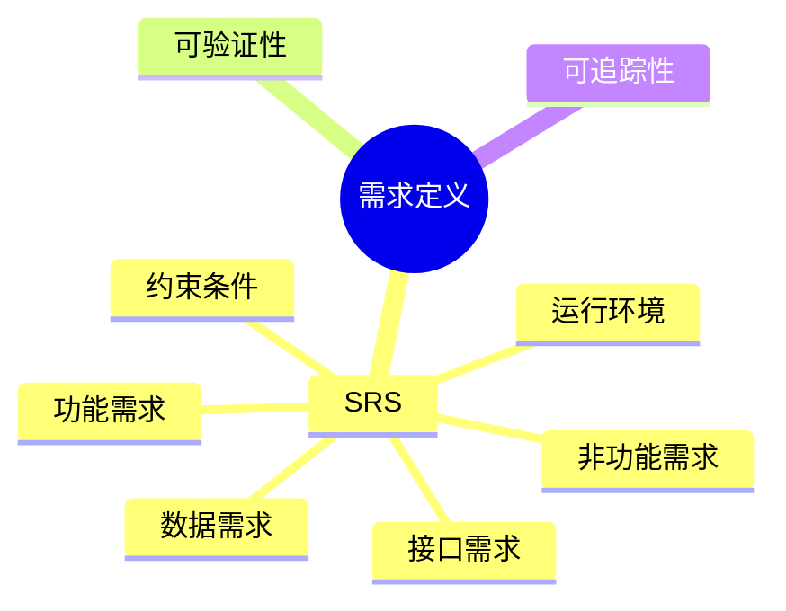

# 第九节 需求定义

> 本文依据《第十章 软件工程》PDF 中**需求定义**相关内容整理，保持课程原有知识框架，不扩展资料之外内容。

---

# 目录

1. 需求定义概述
2. 软件需求规格说明书（SRS）
3. SRS 的主要内容
4. SRS 编写原则
5. SRS 的作用
6. 高频考点
7. 易错点
8. Mermaid 思维导图
9. 本节小结

---

# 1. 需求定义概述

需求定义是在需求获取和需求分析的基础上，对需求进行规范化描述，形成开发、测试和验收共同遵循的正式文档。

课程资料将需求定义作为需求工程的重要阶段，并重点介绍了软件需求规格说明书（SRS）。

---

# 2. 软件需求规格说明书（SRS）

SRS（Software Requirements Specification）用于完整、准确地描述软件系统需求，是软件设计、开发、测试和验收的重要依据。

---

# 3. SRS 的主要内容

课程资料中，SRS 通常包括以下内容：

| 内容 | 说明 |
|------|------|
| 项目概述 | 项目背景、目标、范围 |
| 功能需求 | 系统应实现的功能 |
| 非功能需求 | 性能、安全性、可靠性等要求 |
| 接口需求 | 用户接口、外部接口、系统接口 |
| 数据需求 | 数据结构、数据约束 |
| 运行环境 | 硬件、软件及网络环境 |
| 约束条件 | 标准、法规、技术限制 |

---

# 4. SRS 编写原则

优秀的 SRS 应具备：

- 正确性
- 完整性
- 一致性
- 无歧义性
- 可验证性
- 可追踪性
- 易修改性

---

# 5. SRS 的作用

- 明确系统需求
- 统一项目理解
- 为系统设计提供依据
- 为测试和验收提供标准
- 控制需求变更

---

# 6. 高频考点（★★★★★）

- SRS 定义
- SRS 的主要内容
- SRS 的质量特性
- SRS 在软件生命周期中的作用

---

# 7. 易错点

| 易混知识 | 区别 |
|----------|------|
| 需求定义 vs 需求分析 | 分析需求；形成正式规格说明 |
| SRS vs 用户需求 | SRS 为规范文档；用户需求为原始业务需求 |
| 功能需求 vs 非功能需求 | 描述系统功能；描述质量属性 |

---

# 8. Mermaid 思维导图

---

# 9. 本节小结

需求定义通过 SRS 将需求规范化，是需求工程的重要成果。考试重点围绕 SRS 的组成、质量特性及作用展开，应重点掌握其在软件生命周期中的定位。
