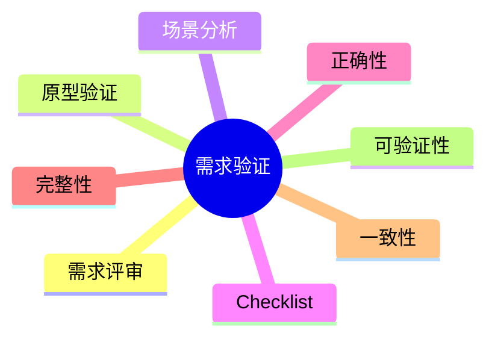

# 第十节 需求验证

> 本文依据《第十章 软件工程》PDF 中**需求验证**相关内容整理，保持课程原有知识框架，不扩展资料之外内容。

---

# 目录

1. 需求验证概述
2. 需求验证目标
3. 需求验证方法
4. 需求评审
5. 原型验证
6. 验证原则
7. 高频考点
8. 易错点
9. Mermaid 思维导图
10. 本节小结

---

# 1. 需求验证概述

需求验证（Requirements Validation）是在需求定义完成后，对需求是否正确、完整、一致、可实现及符合用户真实需求进行确认的过程。

课程资料将需求验证作为需求工程的重要阶段，并介绍了需求评审、原型验证等方法。

---

# 2. 需求验证目标

- 确认需求正确性
- 确认需求完整性
- 消除歧义与冲突
- 验证可实现性
- 获得用户认可

---

# 3. 需求验证方法

| 方法 | 说明 |
|------|------|
| 需求评审 | 组织相关人员共同检查需求文档 |
| 原型验证 | 通过原型确认需求是否符合用户期望 |
| 场景分析 | 验证业务流程是否完整 |
| 检查表（Checklist） | 按标准逐项检查需求质量 |

---

# 4. 需求评审

需求评审是最常见的验证方法。

主要参与人员包括：

- 用户代表
- 需求分析人员
- 项目经理
- 开发人员
- 测试人员

评审重点：

- 正确性
- 完整性
- 一致性
- 可验证性

---

# 5. 原型验证

对于需求不明确或业务复杂的项目，可通过快速构建原型进行验证。

优点：

- 用户参与度高
- 便于发现遗漏需求
- 降低后期修改成本

---

# 6. 验证原则

优秀需求应满足：

- 正确
- 完整
- 一致
- 无歧义
- 可验证
- 可追踪
- 可修改

这些质量特性与 SRS 密切相关。

---

# 7. 高频考点（★★★★★）

- 需求验证定义
- 需求评审
- 原型验证
- 需求质量特性
- 需求验证与需求确认区别

---

# 8. 易错点

| 易混知识 | 区别 |
|----------|------|
| 需求验证 vs 需求获取 | 验证需求质量；收集需求 |
| 需求验证 vs 需求管理 | 验证需求；控制需求变更 |
| 原型开发 vs 原型验证 | 开发原型；利用原型确认需求 |

---

# 9. Mermaid 思维导图

---

# 10. 本节小结

需求验证用于保证需求规格说明书质量，确保需求能够真实反映用户期望，并为设计、开发、测试和验收提供可靠依据。考试重点围绕需求评审、原型验证及需求质量特性展开。
