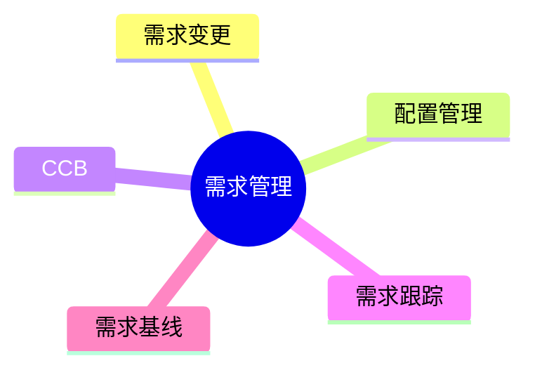

# 第十一节 需求管理

> 本文依据《第十章 软件工程》PDF 中**需求管理**相关内容整理，保持课程原有知识框架，不扩展资料之外内容。

---

# 目录

1. 需求管理概述
2. 需求管理目标
3. 需求变更管理
4. 配置管理与 CCB
5. 需求跟踪（Traceability）
6. 需求基线（Baseline）
7. 高频考点
8. 易错点
9. Mermaid 思维导图
10. 本节小结

---

# 1. 需求管理概述

需求管理（Requirements Management）是在软件生命周期中，对需求进行标识、组织、跟踪、变更控制和维护的过程，确保需求始终保持一致性和可追踪性。

课程资料将需求管理作为需求工程的重要组成部分，并介绍了需求变更、配置管理和 CCB 等内容。

---

# 2. 需求管理目标

- 保持需求一致性
- 控制需求变更
- 保证需求可追踪
- 降低项目风险
- 支撑项目顺利实施

---

# 3. 需求变更管理

需求变更不可避免，应通过规范流程进行控制。

典型流程：

```text
提出变更申请
      ↓
影响分析
      ↓
CCB 审核
      ↓
批准 / 拒绝
      ↓
更新需求文档
      ↓
通知相关人员
```

变更应评估对进度、成本、质量及范围的影响。

---

# 4. 配置管理与 CCB

## 配置管理

配置管理用于管理软件配置项及其版本，保证开发过程的可控性。

主要内容：

- 配置项标识
- 版本控制
- 变更控制
- 配置审计

## CCB（Configuration Control Board）

CCB（配置控制委员会）负责评审和审批需求及配置项变更。

主要职责：

- 审核变更申请
- 评估变更影响
- 批准或拒绝变更
- 监督变更实施

---

# 5. 需求跟踪（Traceability）

需求跟踪用于建立需求与设计、编码、测试之间的对应关系。

主要作用：

- 验证需求是否实现
- 分析变更影响
- 支持测试覆盖
- 保证需求完整性

---

# 6. 需求基线（Baseline）

需求基线是经正式评审确认后的稳定需求版本。

特点：

- 作为后续开发依据
- 未经审批不得随意修改
- 需求变更需经过 CCB

---

# 7. 高频考点（★★★★★）

- 需求管理定义
- 需求变更流程
- CCB 的职责
- 配置管理内容
- 需求跟踪作用
- 需求基线概念

---

# 8. 易错点

| 易混知识 | 区别 |
|----------|------|
| 需求验证 vs 需求管理 | 验证需求质量；控制需求变更 |
| 配置管理 vs 需求管理 | 管理配置项；管理需求全过程 |
| 基线 vs 版本 | 基线是受控版本；版本是软件演进记录 |

---

# 9. Mermaid 思维导图



---

# 10. 本节小结

需求管理贯穿软件开发全过程。考试重点围绕需求变更流程、CCB、需求跟踪和需求基线展开，应理解各概念之间的关系及其在项目管理中的作用。
