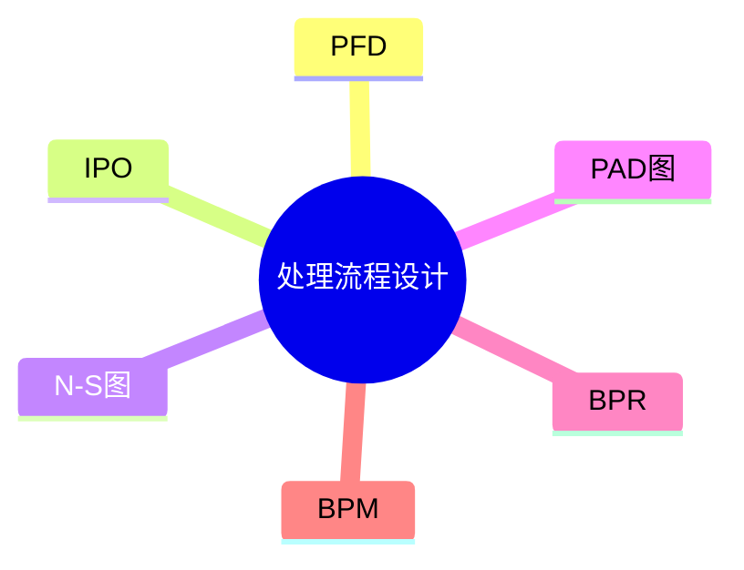

# 第十二节 过程设计

> 本文依据《第十章 软件工程》PDF 中**处理流程设计**相关内容整理，保持课程原有知识框架，不扩展资料之外内容。

---

# 目录

1. 处理流程设计概述
2. 程序流程图（PFD）
3. IPO 图
4. N-S 图
5. PAD 图
6. BPR（业务流程重组）
7. BPM（业务流程管理）
8. 各流程设计方法对比
9. 高频考点
10. 易错点
11. Mermaid 思维导图
12. 本节小结

---

# 1. 处理流程设计概述

处理流程设计是在需求分析完成后，对系统处理逻辑和业务流程进行描述，为详细设计和编码提供依据。

课程资料介绍了程序流程图、IPO 图、N-S 图、PAD 图等流程设计工具，以及 BPR、BPM 等业务流程设计方法。

---

# 2. 程序流程图（PFD）

程序流程图（Program Flow Diagram）用于描述程序执行流程。

| 图形 | 含义 |
|------|------|
| 椭圆 | 开始/结束 |
| 矩形 | 处理 |
| 菱形 | 判断 |
| 平行四边形 | 输入/输出 |
| 箭头 | 控制流程 |

特点：

- 易理解
- 使用广泛
- 适用于算法描述

---

# 3. IPO 图

IPO（Input-Process-Output）图描述系统模块的：

```text
输入（Input）
      ↓
处理（Process）
      ↓
输出（Output）
```

特点：

- 结构清晰
- 适合功能模块设计
- 常用于概要设计

---

# 4. N-S 图

N-S 图（Nassi-Shneiderman Diagram）是一种结构化程序设计图。

特点：

- 不使用流程线
- 支持顺序、选择、循环三种基本结构
- 易转换为程序代码

---

# 5. PAD 图

PAD（Problem Analysis Diagram）采用树形结构描述程序逻辑。

特点：

- 层次清晰
- 逻辑明确
- 易维护

---

# 6. BPR（业务流程重组）

BPR（Business Process Reengineering）强调对业务流程进行根本性重新设计。

目标：

- 提高效率
- 降低成本
- 提升质量
- 优化流程

---

# 7. BPM（业务流程管理）

BPM（Business Process Management）强调业务流程的持续规划、执行、监控与优化。

特点：

- 持续改进
- 全生命周期管理
- 支持企业运营优化

---

# 8. 各流程设计方法对比

| 方法 | 主要特点 | 适用场景 |
|------|----------|----------|
| PFD | 程序执行流程 | 算法设计 |
| IPO | 输入-处理-输出 | 模块设计 |
| N-S 图 | 结构化程序设计 | 结构化开发 |
| PAD 图 | 树形逻辑 | 程序逻辑 |
| BPR | 流程重组 | 企业流程优化 |
| BPM | 流程持续管理 | 企业管理 |

---

# 9. 高频考点（★★★★★）

- PFD 图形符号
- IPO 图组成
- N-S 图特点
- PAD 图特点
- BPR 与 BPM 区别

---

# 10. 易错点

| 易混知识 | 区别 |
|----------|------|
| PFD vs IPO | 程序流程；输入处理输出 |
| N-S 图 vs PAD 图 | 结构化框图；树形逻辑 |
| BPR vs BPM | 流程重组；流程持续管理 |

---

# 11. Mermaid 思维导图



---

# 12. 本节小结

处理流程设计是软件设计的重要组成部分。考试重点围绕 PFD、IPO、N-S 图、PAD 图以及 BPR、BPM 的特点与应用展开，应掌握各种设计方法的适用场景及区别。
