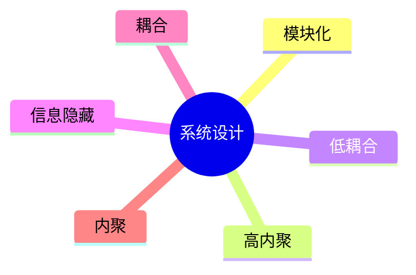

# 第十三节 系统设计

> 本文依据《第十章 软件工程》PDF 中**系统设计**相关内容整理，保持课程原有知识框架，不扩展资料之外内容。

---

# 目录

1. 系统设计概述
2. 系统设计目标
3. 结构化设计原则
4. 模块化设计
5. 模块耦合
6. 模块内聚
7. 系统设计原则
8. 高频考点
9. 易错点
10. Mermaid 思维导图
11. 本节小结

---

# 1. 系统设计概述

系统设计是在需求分析完成后，将需求转换为系统总体结构和详细实现方案的过程，为编码和测试提供依据。

课程资料重点介绍了模块化设计、高内聚低耦合等设计思想。

---

# 2. 系统设计目标

- 满足用户需求
- 提高系统可维护性
- 提高系统可扩展性
- 提高系统可靠性
- 降低开发和维护成本

---

# 3. 结构化设计原则

结构化设计强调：

- 自顶向下
- 逐步求精
- 模块化
- 信息隐藏

其核心目标是降低系统复杂度，提高软件质量。

---

# 4. 模块化设计

模块化设计是将系统划分为多个相对独立的模块。

优点：

- 易开发
- 易测试
- 易维护
- 易复用

---

# 5. 模块耦合（Coupling）

耦合表示模块之间的依赖程度。

一般原则：

> **耦合越低越好。**

常见耦合类型（由低到高）：

| 类型 | 特点 |
|------|------|
| 非直接耦合 | 模块之间无直接联系 |
| 数据耦合 | 参数传递数据 |
| 标记耦合 | 传递数据结构 |
| 控制耦合 | 传递控制信息 |
| 外部耦合 | 依赖外部环境 |
| 公共耦合 | 共享公共数据 |
| 内容耦合 | 一个模块直接访问另一个模块内部 |

---

# 6. 模块内聚（Cohesion）

内聚表示模块内部各功能之间的关联程度。

一般原则：

> **内聚越高越好。**

常见内聚类型（由低到高）：

| 类型 | 特点 |
|------|------|
| 偶然内聚 | 无明显关系 |
| 逻辑内聚 | 相似功能集中 |
| 时间内聚 | 同一时间执行 |
| 过程内聚 | 同一处理流程 |
| 通信内聚 | 操作同一数据 |
| 顺序内聚 | 前后结果相关 |
| 功能内聚 | 完成单一功能 |

---

# 7. 系统设计原则

- 高内聚
- 低耦合
- 模块独立
- 信息隐藏
- 可维护性
- 可扩展性

---

# 8. 高频考点（★★★★★）

- 高内聚、低耦合
- 耦合类型排序
- 内聚类型排序
- 模块化设计思想
- 结构化设计原则

---

# 9. 易错点

| 易混知识 | 区别 |
|----------|------|
| 耦合 vs 内聚 | 模块之间关系；模块内部关系 |
| 高内聚 vs 低耦合 | 内部关联强；模块依赖弱 |
| 数据耦合 vs 控制耦合 | 传递数据；传递控制信息 |

---

# 10. Mermaid 思维导图

---

# 11. 本节小结

系统设计是软件开发的重要阶段。考试重点围绕模块化设计、高内聚低耦合、耦合与内聚类型展开，应掌握各类型特点及排序，并理解其在软件设计中的应用。
