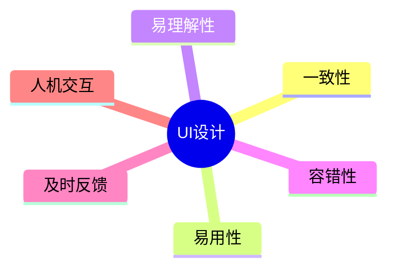

# 第十四节 UI 设计

> 本文依据《第十章 软件工程》PDF 中**人机界面设计**相关内容整理，保持课程原有知识框架，不扩展资料之外内容。

---

# 目录

1. 人机界面设计概述
2. 人机界面设计目标
3. 界面设计基本原则
4. 人机交互设计
5. 常见界面设计规范
6. 高频考点
7. 易错点
8. Mermaid 思维导图
9. 本节小结

---

# 1. 人机界面设计概述

人机界面（User Interface，UI）设计是系统设计的重要组成部分，负责设计用户与系统之间的交互方式，使系统易于学习、易于使用并提高工作效率。

课程资料重点介绍了人机界面设计的基本原则及设计要求。

---

# 2. 人机界面设计目标

主要目标包括：

- 操作简单
- 易于学习
- 提高工作效率
- 减少用户操作失误
- 提升用户满意度

---

# 3. 界面设计基本原则

课程资料强调以下设计原则：

| 原则 | 说明 |
|------|------|
| 一致性 | 界面风格、操作方式保持一致 |
| 易用性 | 操作简单、符合用户习惯 |
| 易理解性 | 信息表达清晰明确 |
| 容错性 | 支持错误恢复，避免误操作 |
| 及时反馈 | 对用户操作及时响应 |

---

# 4. 人机交互设计

良好的交互设计应做到：

- 合理的信息组织
- 清晰的导航结构
- 简洁的页面布局
- 明确的操作反馈
- 合理的提示信息

---

# 5. 常见界面设计规范

- 页面布局统一
- 按钮位置固定
- 图标含义明确
- 字体与颜色统一
- 错误提示友好
- 输入输出规范

---

# 6. 高频考点（★★★★★）

- 人机界面设计目标
- 界面设计原则
- 一致性原则
- 易用性原则
- 容错性与反馈机制

---

# 7. 易错点

| 易混知识 | 区别 |
|----------|------|
| 一致性 vs 易用性 | 风格统一；操作方便 |
| 易理解性 vs 易学习性 | 信息清晰；学习成本低 |
| 容错性 vs 安全性 | 防止误操作；保护系统资源 |

---

# 8. Mermaid 思维导图

---

# 9. 本节小结

人机界面设计直接影响软件系统的可用性和用户体验。考试重点围绕界面设计目标、基本原则及交互设计展开，应重点掌握一致性、易用性、容错性和及时反馈等核心原则。
