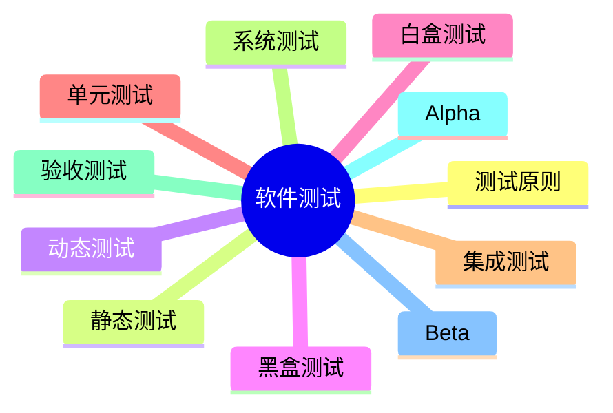

# 第十五节 软件测试

> 本文依据《第十章 软件工程》PDF 中**软件测试**相关内容整理，保持课程原有知识框架，不扩展资料之外内容。

---

# 目录

1. 软件测试概述
2. 软件测试原则
3. 静态测试与动态测试
4. 黑盒测试
5. 白盒测试
6. 软件测试阶段
7. Alpha 与 Beta 测试
8. 高频考点
9. 易错点
10. Mermaid 思维导图
11. 本节小结

---

# 1. 软件测试概述

软件测试是在规定条件下运行软件，发现缺陷、验证软件是否满足需求的过程。

课程资料重点介绍了测试原则、测试分类以及各测试阶段，是本章最重要的考点之一。

---

# 2. 软件测试原则

- 测试只能证明缺陷存在，不能证明没有缺陷
- 应尽早开展测试
- 测试应覆盖典型场景和边界情况
- 缺陷通常集中出现
- 测试活动应独立进行

---

# 3. 静态测试与动态测试

| 类型 | 特点 |
|------|------|
| 静态测试 | 不运行程序，主要进行评审、走查、静态分析 |
| 动态测试 | 运行程序，通过执行发现缺陷 |

---

# 4. 黑盒测试

黑盒测试关注软件**功能是否符合需求**，不关心内部实现。

常见方法：

- 等价类划分
- 边界值分析
- 判定表
- 因果图
- 场景法

---

# 5. 白盒测试

白盒测试关注程序**内部逻辑结构**。

常见覆盖标准：

- 语句覆盖
- 判定覆盖
- 条件覆盖
- 判定/条件覆盖
- 路径覆盖

---

# 6. 软件测试阶段

| 阶段 | 主要目标 |
|------|----------|
| 单元测试 | 验证模块功能 |
| 集成测试 | 验证模块接口 |
| 系统测试 | 验证整体系统 |
| 验收测试 | 验证是否满足用户需求 |

---

# 7. Alpha 与 Beta 测试

## Alpha 测试

- 开发方组织实施
- 模拟真实环境
- 发布前进行

## Beta 测试

- 真实用户参与
- 实际运行环境
- 收集反馈并改进

---

# 8. 高频考点（★★★★★）

- 软件测试原则
- 黑盒测试与白盒测试区别
- 常见黑盒测试方法
- 白盒覆盖标准
- 四个测试阶段
- Alpha 与 Beta 测试区别

---

# 9. 易错点

| 易混知识 | 区别 |
|----------|------|
| 黑盒 vs 白盒 | 功能测试；结构测试 |
| Alpha vs Beta | 开发方；真实用户 |
| 静态测试 vs 动态测试 | 不运行程序；运行程序 |

---

# 10. Mermaid 思维导图

---

# 11. 本节小结

软件测试是软件工程章节分值最高的内容之一。考试重点围绕测试原则、黑盒测试、白盒测试、测试阶段以及 Alpha/Beta 测试展开，应重点掌握各种测试方法的特点及适用场景。
