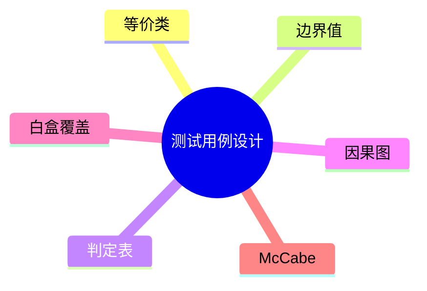

# 第十六节 测试用例设计

> 本文依据《第十章 软件工程》PDF 中**测试用例设计**相关内容整理，保持课程原有知识框架，不扩展资料之外内容。

---

# 目录

1. 测试用例设计概述
2. 等价类划分法
3. 边界值分析法
4. 判定表法
5. 因果图法
6. 白盒测试覆盖
7. McCabe 圈复杂度
8. 高频考点
9. 易错点
10. Mermaid 思维导图
11. 本节小结

---

# 1. 测试用例设计概述

测试用例设计是在明确测试目标后，根据需求和测试方法设计输入、执行步骤及预期结果，以提高测试覆盖率和发现缺陷的能力。

课程资料重点介绍了黑盒测试常用设计方法及白盒覆盖标准。

---

# 2. 等价类划分法

等价类划分将输入划分为若干具有代表性的集合。

分为：

- 有效等价类
- 无效等价类

特点：

- 减少测试用例数量
- 保证代表性

---

# 3. 边界值分析法

边界值分析重点测试输入范围的边界位置。

常见边界：

- 最小值
- 最大值
- 最小值附近
- 最大值附近

边界位置最容易产生缺陷，是历年高频考点。

---

# 4. 判定表法

判定表适用于存在多个条件和多个动作组合的业务逻辑。

组成：

| 部分 | 说明 |
|------|------|
| 条件桩 | 输入条件 |
| 条件项 | 条件取值 |
| 动作桩 | 输出动作 |
| 动作项 | 动作执行情况 |

---

# 5. 因果图法

因果图通过分析输入条件（因）与输出结果（果）的关系，生成测试用例。

特点：

- 适用于复杂逻辑
- 常与判定表结合使用

---

# 6. 白盒测试覆盖

课程资料介绍的覆盖标准包括：

- 语句覆盖
- 判定覆盖
- 条件覆盖
- 判定/条件覆盖
- 路径覆盖

覆盖程度通常由低到高逐步增强。

---

# 7. McCabe 圈复杂度

McCabe 圈复杂度用于衡量程序控制流复杂程度。

主要作用：

- 评估程序复杂度
- 确定独立路径数量
- 辅助设计白盒测试用例

---

# 8. 高频考点（★★★★★）

- 等价类划分
- 边界值分析
- 判定表
- 因果图
- 白盒覆盖标准
- McCabe 圈复杂度

---

# 9. 易错点

| 易混知识 | 区别 |
|----------|------|
| 等价类 vs 边界值 | 代表性输入；边界输入 |
| 判定表 vs 因果图 | 条件组合；条件关系 |
| 判定覆盖 vs 条件覆盖 | 判定真假；每个条件真假 |

---

# 10. Mermaid 思维导图

---

# 11. 本节小结

测试用例设计是软件测试的重要组成部分。考试重点围绕等价类划分、边界值分析、判定表、因果图、白盒覆盖标准及 McCabe 圈复杂度展开，应重点掌握各种方法的适用场景及区别。
