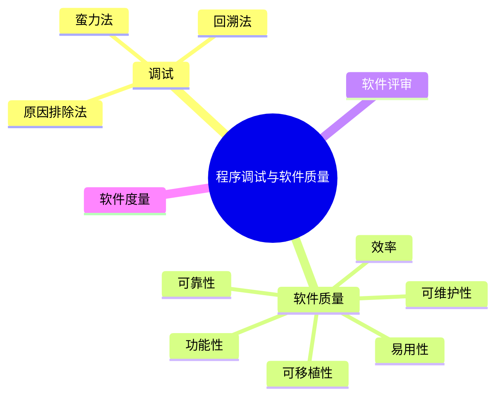

# 第十七节 调试与软件质量

> 本文依据《第十章 软件工程》PDF 中**程序调试与软件质量**相关内容整理，保持课程原有知识框架，不扩展资料之外内容。

---

# 目录

1. 程序调试概述
2. 常见调试方法
3. 软件质量概述
4. 软件质量特性
5. 软件评审与软件度量
6. 高频考点
7. 易错点
8. Mermaid 思维导图
9. 本节小结

---

# 1. 程序调试概述

程序调试（Debug）是在测试发现缺陷后，对缺陷进行定位、分析并修复的过程，其目标是消除软件错误并验证修改结果。

课程资料将调试作为软件测试后的重要活动进行介绍。

---

# 2. 常见调试方法

| 调试方法 | 说明 |
|----------|------|
| 蛮力法（Brute Force） | 通过日志、打印、跟踪定位问题 |
| 回溯法（Backtracking） | 从错误位置反向查找原因 |
| 原因排除法（Cause Elimination） | 假设原因并逐步排除，缩小范围 |

调试完成后，应进行回归测试，确认修复未引入新的缺陷。

---

# 3. 软件质量概述

软件质量是软件满足规定需求和用户期望的能力。

软件质量管理贯穿软件生命周期，包括：

- 质量计划
- 质量保证
- 质量控制
- 持续改进

---

# 4. 软件质量特性

课程资料介绍的软件质量特性主要包括：

| 特性 | 说明 |
|------|------|
| 功能性 | 满足功能需求 |
| 可靠性 | 稳定运行能力 |
| 易用性 | 易学习、易操作 |
| 效率 | 时间和资源利用效率 |
| 可维护性 | 易修改、易测试 |
| 可移植性 | 易迁移到不同平台 |

---

# 5. 软件评审与软件度量

## 软件评审

用于检查软件产品质量，包括：

- 需求评审
- 设计评审
- 代码评审

## 软件度量

通过量化指标评价软件产品和开发过程，例如：

- 缺陷数量
- 代码规模
- 测试覆盖率
- 生产率

---

# 6. 高频考点（★★★★★）

- 调试方法
- 软件质量特性
- 软件评审
- 软件度量
- 调试与测试区别

---

# 7. 易错点

| 易混知识 | 区别 |
|----------|------|
| 测试 vs 调试 | 测试发现缺陷；调试修复缺陷 |
| 软件质量保证 vs 软件质量控制 | 过程保证；产品控制 |
| 可靠性 vs 可维护性 | 稳定运行；便于修改维护 |

---

# 8. Mermaid 思维导图

---

# 9. 本节小结

程序调试与软件质量是软件工程的重要组成部分。考试重点围绕调试方法、软件质量特性、软件评审及软件度量展开，应重点掌握各种质量特性的含义以及测试与调试之间的区别。
