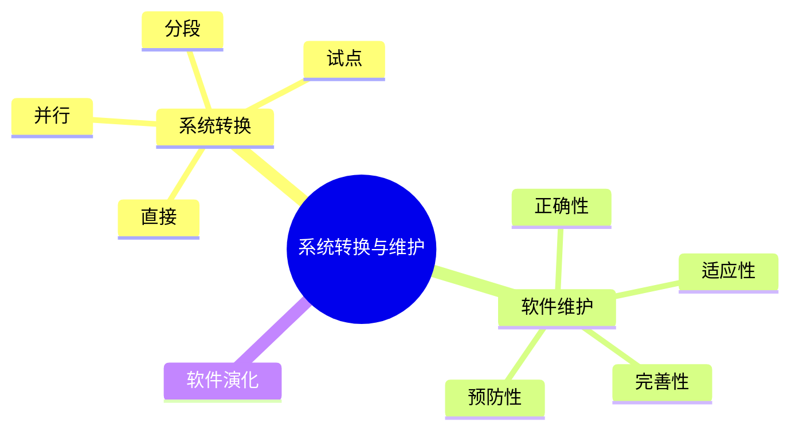

# 第十八节 系统转换与维护

> 本文依据《第十章 软件工程》PDF 中**系统转换与软件维护**相关内容整理，保持课程原有知识框架，不扩展资料之外内容。

---

# 目录

1. 系统转换概述
2. 系统转换方式
3. 软件维护概述
4. 软件维护分类
5. 软件维护流程
6. 软件演化
7. 高频考点
8. 易错点
9. Mermaid 思维导图
10. 本节小结

---

# 1. 系统转换概述

系统转换是指新系统投入运行并替代旧系统的过程，应保证业务连续性、数据完整性及系统稳定运行。

课程资料介绍了常见系统转换方式及软件维护相关内容。

---

# 2. 系统转换方式

| 转换方式 | 特点 | 优缺点 |
|----------|------|--------|
| 直接转换 | 新系统一次性替换旧系统 | 成本低、风险高 |
| 并行转换 | 新旧系统同时运行 | 风险低、成本高 |
| 分段转换 | 按模块逐步切换 | 风险适中、实施灵活 |
| 试点转换 | 先局部试运行，再全面推广 | 易发现问题、推广稳妥 |

---

# 3. 软件维护概述

软件维护是在软件交付后，为适应环境变化、修复缺陷或满足新需求而进行的修改活动。

软件维护贯穿软件运行阶段，是软件生命周期的重要组成部分。

---

# 4. 软件维护分类

| 类型 | 说明 |
|------|------|
| 正确性维护 | 修复软件缺陷 |
| 适应性维护 | 适应环境变化 |
| 完善性维护 | 增强功能、提升性能 |
| 预防性维护 | 提高可维护性，预防潜在问题 |

---

# 5. 软件维护流程

```text
问题发现
    ↓
问题分析
    ↓
修改设计
    ↓
修改程序
    ↓
测试验证
    ↓
发布维护版本
```

维护完成后应进行回归测试，确保修改未影响原有功能。

---

# 6. 软件演化

随着业务和技术的发展，软件系统需要持续演化。

主要目标：

- 满足新业务需求
- 提升系统性能
- 增强可维护性
- 延长软件生命周期

---

# 7. 高频考点（★★★★★）

- 四种系统转换方式
- 软件维护四种类型
- 各转换方式优缺点
- 软件维护流程
- 软件演化思想

---

# 8. 易错点

| 易混知识 | 区别 |
|----------|------|
| 并行转换 vs 试点转换 | 全面双系统运行；局部先试运行 |
| 正确性维护 vs 完善性维护 | 修复缺陷；增强功能 |
| 适应性维护 vs 预防性维护 | 适应环境变化；提前优化维护性 |

---

# 9. Mermaid 思维导图



---

# 10. 本节小结

系统转换与软件维护是软件生命周期后期的重要内容。考试重点围绕系统转换方式、软件维护分类及软件演化展开，应重点掌握各种维护类型和转换方式的特点及适用场景。
