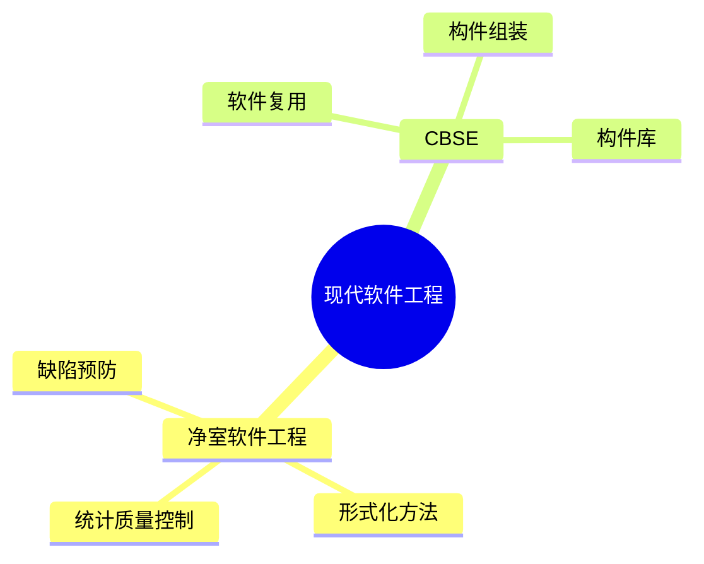

# 第十九节 净室软件工程与 CBSD

> 本文依据《第十章 软件工程》PDF 中**净室软件工程（Cleanroom Software Engineering）**、**基于构件的软件开发（CBSE/CBSD）**相关内容整理，保持课程原有知识框架，不扩展资料之外内容。

---

# 目录

1. 净室软件工程概述
2. 净室软件工程特点
3. 基于构件的软件开发（CBSE/CBSD）
4. 软件复用
5. 构件库
6. 两种方法对比
7. 高频考点
8. 易错点
9. Mermaid 思维导图
10. 本节小结

---

# 1. 净室软件工程概述

净室软件工程（Cleanroom Software Engineering）是一种强调**缺陷预防**的软件开发方法，通过形式化方法、严格评审和统计质量控制，提高软件可靠性。

课程资料将其作为现代软件工程方法进行介绍。

---

# 2. 净室软件工程特点

主要特点：

- 缺陷预防优先
- 形式化规格说明
- 严格设计与代码评审
- 增量式开发
- 统计质量控制
- 强调软件可靠性

---

# 3. 基于构件的软件开发（CBSE/CBSD）

CBSE（Component-Based Software Engineering）或 CBSD（Component-Based Software Development）强调利用已有软件构件快速组装系统。

主要特点：

- 软件复用
- 构件组装
- 降低开发成本
- 缩短开发周期
- 提高开发效率

---

# 4. 软件复用

软件复用是在不同项目中重复利用已有的软件资产。

可复用对象包括：

- 软件构件
- 框架
- 类库
- 接口
- 设计模式
- 文档

---

# 5. 构件库

构件库用于统一管理和维护软件构件。

主要作用：

- 构件分类
- 构件检索
- 版本管理
- 构件共享
- 构件维护

---

# 6. 两种方法对比

| 对比项 | 净室软件工程 | CBSE/CBSD |
|---------|--------------|-----------|
| 核心思想 | 缺陷预防 | 软件复用 |
| 关注重点 | 软件质量与可靠性 | 开发效率与复用 |
| 主要方法 | 形式化方法、统计质量控制 | 构件组装、构件库 |

---

# 7. 高频考点（★★★★★）

- 净室软件工程特点
- 统计质量控制
- CBSE/CBSD 概念
- 软件复用
- 构件库作用

---

# 8. 易错点

| 易混知识 | 区别 |
|----------|------|
| 软件测试 vs 净室软件工程 | 发现缺陷；预防缺陷 |
| CBSE vs 软件复用 | 开发方法；核心思想 |
| 构件库 vs 代码仓库 | 管理复用构件；管理源代码 |

---

# 9. Mermaid 思维导图

---

# 10. 本节小结

净室软件工程强调通过缺陷预防和统计质量控制提升软件质量；CBSE/CBSD 强调通过构件复用提升开发效率。考试重点围绕两种方法的核心思想、特点及区别展开。
