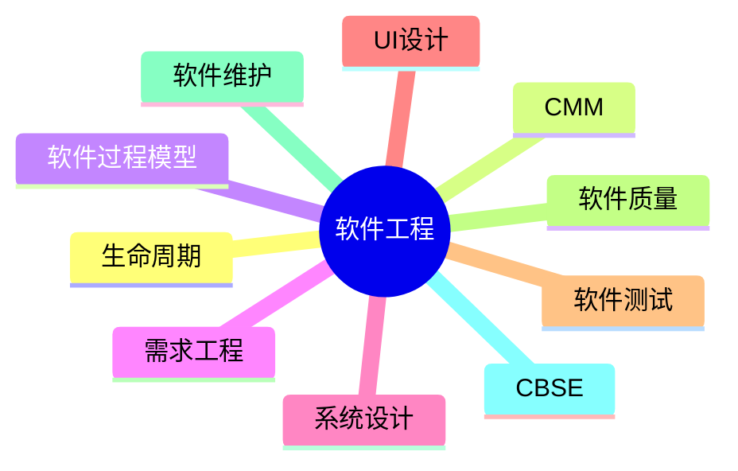

# 第十章总结

> 本节依据第十章课件整理，作为全章复习资料。

---

# 一、本章知识体系

```text
软件工程
│
├── 软件工程概述
│   ├── 软件危机
│   ├── 生命周期
│   └── PDCA
│
├── CMM / CMMI
│
├── 软件过程模型
│   ├── 瀑布
│   ├── V
│   ├── 原型
│   ├── 增量
│   ├── 螺旋
│   ├── 喷泉
│   ├── CBSD
│   └── 敏捷
│
├── 需求工程
│   ├── 获取
│   ├── 分析
│   ├── 定义（SRS）
│   ├── 验证
│   └── 管理
│
├── 系统设计
│   ├── 流程设计
│   ├── 高内聚
│   └── 低耦合
│
├── 人机界面设计
│
├── 软件测试
│   ├── 黑盒
│   ├── 白盒
│   ├── Alpha
│   └── Beta
│
├── 调试与软件质量
│
├── 系统转换与维护
│
└── 净室软件工程 / CBSE
```

---

# 二、必背英文缩写

| 缩写 | 含义 |
|------|------|
| CMM | Capability Maturity Model |
| CMMI | Capability Maturity Model Integration |
| DFD | Data Flow Diagram |
| DD | Data Dictionary |
| ER | Entity-Relationship |
| SRS | Software Requirements Specification |
| PFD | Program Flow Diagram |
| IPO | Input-Process-Output |
| PAD | Problem Analysis Diagram |
| UI | User Interface |
| UX | User Experience |
| CCB | Configuration Control Board |
| CBSE/CBSD | Component-Based Software Engineering/Development |

---

# 三、易混知识对比

| 对比 | 区别 |
|------|------|
| 瀑布模型 vs V 模型 | V 模型增加测试对应关系 |
| 原型模型 vs 增量模型 | 验证需求；逐步交付 |
| 黑盒测试 vs 白盒测试 | 功能测试；结构测试 |
| 耦合 vs 内聚 | 模块间关系；模块内关系 |
| 测试 vs 调试 | 发现缺陷；修复缺陷 |
| BPR vs BPM | 流程重组；流程持续管理 |

---

# 四、高频考点（★★★★★）

- 软件生命周期
- CMM/CMMI 五级模型
- 软件过程模型特点
- DFD、E-R 图、SRS
- 高内聚、低耦合
- 黑盒测试与白盒测试
- 测试覆盖标准
- 系统转换方式
- 软件维护类型
- 净室软件工程
- CBSE/CBSD

以上均为课程资料重点内容。

---

# 五、记忆建议

1. 模型采用对比记忆法。
2. 图形工具按用途分类记忆（DFD、E-R、PFD、IPO）。
3. 软件测试重点掌握黑盒、白盒及覆盖标准。
4. 耦合与内聚牢记“低耦合、高内聚”。

---

# 六、Mermaid 思维导图



---

# 七、考前冲刺建议

- 优先复习课程资料中的高频模型与概念。
- 熟悉需求工程、系统设计、软件测试三大模块。
- 对易混概念进行分类整理。
- 配合历年真题和章节练习查漏补缺。

---

# 八、本章总结

第十章是《系统架构设计师》考试的重要得分章节，涵盖软件工程基础、需求工程、系统设计、软件测试、软件维护及现代软件工程方法。建议结合本章全部 Markdown 文档系统复习，重点掌握高频考点及概念辨析。
