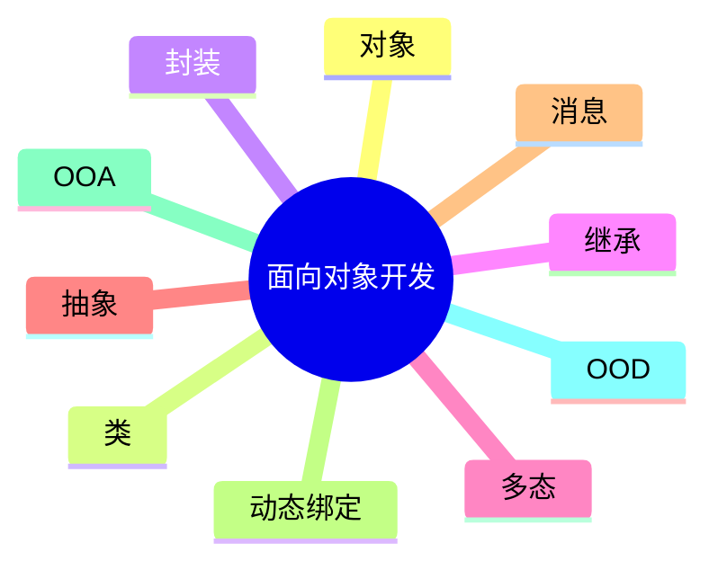

# 第二节 面向对象开发

> 本节依据第十一章课件中的面向对象开发内容整理。

---

# 目录

1. 面向对象开发概述
2. 面向对象基本概念
3. 面向对象四大特性
4. 消息与动态绑定
5. OOA 与 OOD
6. 面向对象测试
7. 高频考点
8. 易错点
9. Mermaid 思维导图
10. 本节小结

---

# 1. 面向对象开发概述

面向对象开发（Object-Oriented Development，OOD）以对象为核心，将系统划分为多个相互协作的对象，通过封装、继承、多态等机制组织软件结构，是课程介绍的主要开发思想之一。

---

# 2. 面向对象基本概念

| 概念 | 说明 |
|------|------|
| 对象（Object） | 具有状态和行为的实体 |
| 类（Class） | 对具有相同属性和行为对象的抽象 |
| 属性（Attribute） | 对象的状态 |
| 方法（Method） | 对象能够执行的操作 |
| 消息（Message） | 对象之间进行通信的方式 |

---

# 3. 面向对象四大特性

## 封装（Encapsulation）

将数据与操作封装在对象内部，对外仅暴露必要接口。

## 继承（Inheritance）

子类继承父类已有属性和方法，提高代码复用性。

## 多态（Polymorphism）

相同接口在不同对象上表现出不同实现。

## 抽象（Abstraction）

提取事物共同特征，形成类和模型。

---

# 4. 消息与动态绑定

- **消息**：对象之间通过发送消息请求执行操作。
- **动态绑定**：程序运行时确定实际调用的方法，实现多态机制。

---

# 5. OOA 与 OOD

| 缩写 | 含义 | 主要任务 |
|------|------|----------|
| OOA | Object-Oriented Analysis | 建立对象分析模型 |
| OOD | Object-Oriented Design | 根据分析模型完成系统设计 |

---

# 6. 面向对象测试

课程资料介绍面向对象测试主要围绕对象、类及继承关系展开，包括：

- 类测试
- 对象测试
- 集成测试
- 系统测试

---

# 7. 高频考点（★★★★★）

- 对象与类
- 封装、继承、多态、抽象
- 消息机制
- 动态绑定
- OOA 与 OOD 区别
- 面向对象测试

---

# 8. 易错点

| 易混知识 | 区别 |
|----------|------|
| 对象 vs 类 | 实例；模板 |
| 封装 vs 抽象 | 隐藏实现；提取共同特征 |
| 继承 vs 多态 | 代码复用；同一接口不同实现 |
| OOA vs OOD | 分析；设计 |

---

# 9. Mermaid 思维导图

---

# 10. 本节小结

面向对象开发是本章基础内容。考试重点围绕对象、类、封装、继承、多态、动态绑定以及 OOA、OOD 等概念展开，应重点掌握各概念之间的联系与区别。
