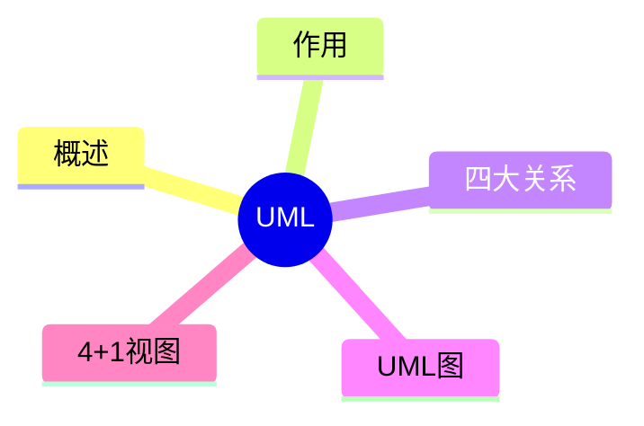

# 第三节 UML 概述

> 本文依据《第十一章 面向对象技术》PDF 中 **UML（统一建模语言）** 相关内容整理，保持课程原有知识体系，不扩展资料之外内容。

---

# 目录

1. UML 概述
2. UML 的作用
3. UML 的组成
4. UML 的特点
5. UML 的应用
6. 高频考点
7. 易错点
8. Mermaid 思维导图
9. 本节小结

---

# 1. UML 概述

UML（Unified Modeling Language，统一建模语言）是一种用于面向对象系统分析、设计和建模的标准化图形语言。课程资料将 UML 作为面向对象开发的重要建模工具进行介绍。

---

# 2. UML 的作用

- 描述系统结构
- 描述系统行为
- 支持分析与设计
- 提高沟通效率
- 为系统实现提供模型基础

---

# 3. UML 的组成

课程资料主要介绍：

- UML 基本概念
- UML 四大关系
- UML 常见图
- UML 4+1 视图

这些内容将在后续小节分别展开。

---

# 4. UML 的特点

- 图形化表示
- 面向对象
- 标准化建模
- 支持系统全生命周期
- 易于交流与维护

---

# 5. UML 的应用

UML 可应用于：

- 面向对象分析（OOA）
- 面向对象设计（OOD）
- 软件架构设计
- 系统建模
- 文档编制

---

# 6. 高频考点（★★★★★）

- UML 定义
- UML 的作用
- UML 基本组成
- UML 在开发过程中的应用

---

# 7. 易错点

| 易混知识 | 区别 |
|----------|------|
| UML vs OOA | UML 是建模语言；OOA 是分析方法 |
| UML vs OOD | UML 是建模工具；OOD 是设计过程 |

---

# 8. Mermaid 思维导图

---

# 9. 本节小结

UML 是面向对象开发中最重要的建模语言。本节重点掌握 UML 的定义、作用、组成及应用，为后续学习 UML 各类图和关系奠定基础。
