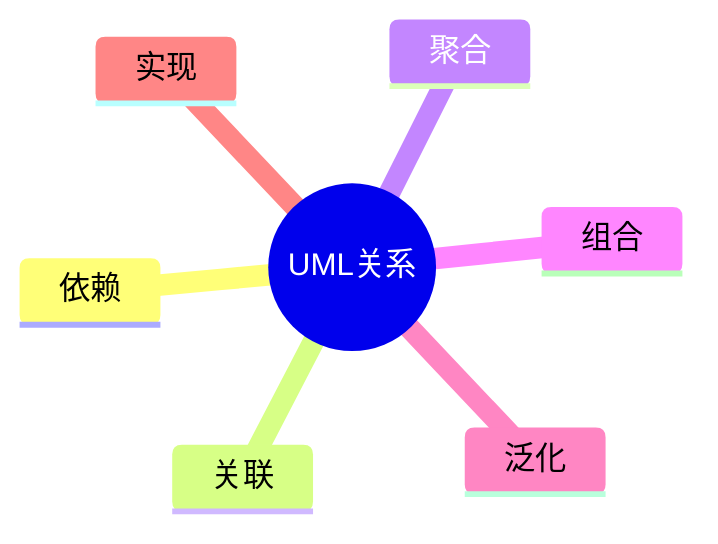

# 第四节 UML 关系

> 本文依据《第十一章 面向对象技术》PDF 中 **UML 关系**相关内容整理，保持课程原有知识体系，不扩展资料之外内容。

---

# 目录

1. UML 关系概述
2. 依赖（Dependency）
3. 关联（Association）
4. 聚合（Aggregation）
5. 组合（Composition）
6. 泛化（Generalization）
7. 实现（Realization）
8. 高频考点
9. 易错点
10. Mermaid 思维导图
11. 本节小结

---

# 1. UML 关系概述

UML 使用不同关系描述类、对象及其他模型元素之间的联系。课程资料重点介绍 UML 中常见关系及其图形表示。

---

# 2. 依赖（Dependency）

- 表示一个元素临时使用另一个元素。
- 一方发生变化可能影响另一方。
- 图形：**虚线箭头**。

---

# 3. 关联（Association）

- 表示对象之间长期存在联系。
- 可表示单向或双向关联。
- 图形：**实线**。

---

# 4. 聚合（Aggregation）

- 表示整体与部分关系。
- 部分对象可独立存在。
- 图形：**空心菱形 + 实线**。

---

# 5. 组合（Composition）

- 表示更强的整体与部分关系。
- 整体消失，部分通常随之消失。
- 图形：**实心菱形 + 实线**。

---

# 6. 泛化（Generalization）

- 即继承关系。
- 子类继承父类。
- 图形：**空心三角箭头 + 实线**。

---

# 7. 实现（Realization）

- 表示类实现接口。
- 图形：**空心三角箭头 + 虚线**。

---

# 8. 高频考点（★★★★★）

- UML 各种关系含义
- 聚合与组合区别
- 泛化与实现区别
- UML 图形符号识别

---

# 9. 易错点

| 易混知识 | 区别 |
|----------|------|
| 聚合 vs 组合 | 生命周期独立；生命周期依赖 |
| 泛化 vs 实现 | 继承类；实现接口 |
| 依赖 vs 关联 | 临时使用；长期联系 |

---

# 10. Mermaid 思维导图

---

# 11. 本节小结

UML 关系是历年考试重点，尤其需要掌握依赖、关联、聚合、组合、泛化和实现的含义、图形表示及区别，并能够根据 UML 类图正确识别各种关系。
